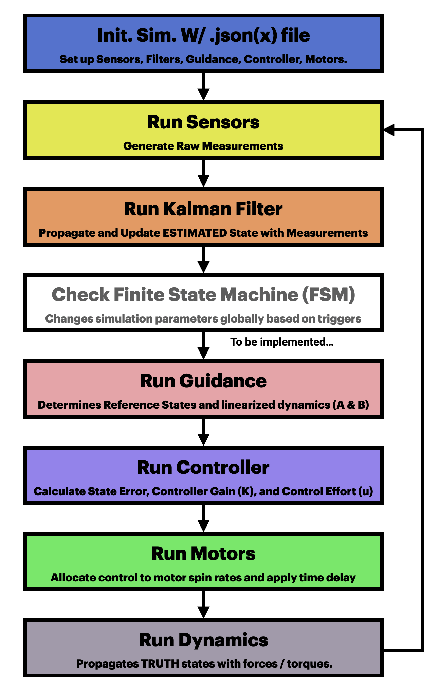
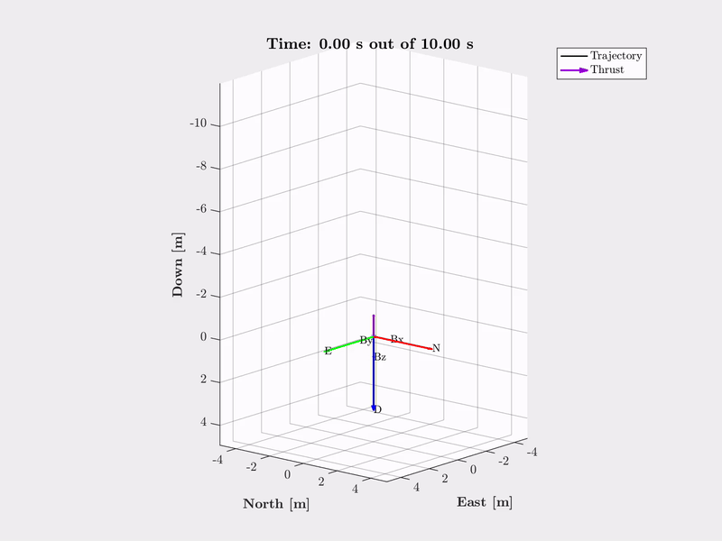
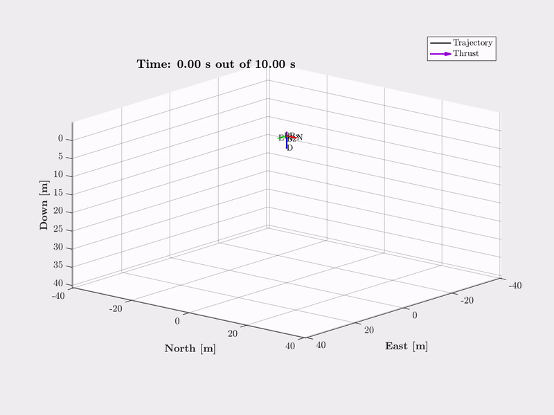
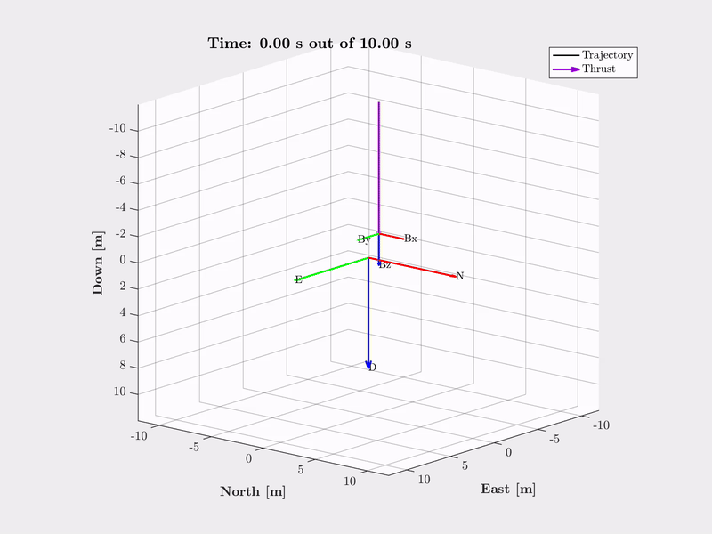

# Quadcopter from Scratch: 6DOF MATLAB Simulation
**Part 1 of building a quadcopter from "scratch"**  
<a href="https://github.com/ex33/drone_sim" class="tag tag-big">GITHUB</a>
---

  

## Summary
This is <strong>Part 1</strong> of my quadcopter project. This part will go over my 6DOF simulation in MATLAB completed with:  

• Sensor modeling w/ noise 

• Motor modeling w/ time delay

• LQR Controller for setpoint regulation (waypoint)

• 18-State Error-State Kalman Filter w/ Bias States 

• Closed-loop propagation through non-linear dynamics for end-to-end GNC validation

For more background material, see [Part 0](quadcopterPart0.html). This section contains little to no context on some of the things that goes on, so it somewhat requires taking a quick look at the previous section. I will try to come back here and make this more stand-alone at some point.

## Table of Content
• <a href="#introduction">Introduction</a> 

• <a href="#overview">Overview</a> 

• <a href="#simulation-modules">Simulation Modules</a> 
  &nbsp;&nbsp;&nbsp;&nbsp;↳ <a href="#sensors">Sensors</a> 
  &nbsp;&nbsp;&nbsp;&nbsp;↳ <a href="#error-state-kalman-filter">Error State Kalman Filter</a> 
  &nbsp;&nbsp;&nbsp;&nbsp;↳ <a href="#guidance">Guidance</a> 
  &nbsp;&nbsp;&nbsp;&nbsp;↳ <a href="#control">Control</a> 
  &nbsp;&nbsp;&nbsp;&nbsp;↳ <a href="#motors">Motors</a> 
  &nbsp;&nbsp;&nbsp;&nbsp;↳ <a href="#Dynamics">Dynamics</a> 

• <a href="#simlation-progression">Simulation Progression</a> 
  &nbsp;&nbsp;&nbsp;&nbsp;↳ <a href="#order-0-simulation">Order 0 Simulation</a> 
  &nbsp;&nbsp;&nbsp;&nbsp;↳ <a href="#order-1-simulation">Order 1 Simulation</a> 
  &nbsp;&nbsp;&nbsp;&nbsp;↳ <a href="#order-2-simulation">Order 2 Simulation</a> 

• <a href="#utilizing-the-simulation">Utilizing the Simulation</a> 
  &nbsp;&nbsp;&nbsp;&nbsp;↳ <a href="#system-parameters">System Parameters</a> 

• <a href="#whats-next">Whats Next?</a> 
  &nbsp;&nbsp;&nbsp;&nbsp;↳ <a href="#integral-control-to-lqr-lqi">Integral Control to LQR (LQI)</a> 
  &nbsp;&nbsp;&nbsp;&nbsp;↳ <a href="#optimal-trajectories">Optimal Trajectories</a> 
  &nbsp;&nbsp;&nbsp;&nbsp;↳ <a href="#other-uav-platforms">Other UAV Platforms</a> 

<h2 id="Introduction">Introduction</h2>
Since this is the first part, the introduction to this project will be place here. 

From my first full time role, I was able to gain lots of experience in simulation and modeling of satellites, having the opportunities to determine necessary answers to mature a design from conception, and executing the accompanying analysis needed for design choices. I was able to deepen my understanding of many GNC concepts from my coursework through real world applications, particularly in state estimation, guidance algorithms (orbital maneuvers/trajectories and attitude pointing), and system level integration of hardware. I also become more confident in my software skills, having to learn RPO and C++ at the same time, and spending hundreds of hours contributing to the many simulation tools and approving pull requests.  

However, at the start of this, my main knowledge gap still lies within the transition from simulation onto real hardware and all the associated challeges that comes with that, which is what I'd hoped to bridge with this project. While I would have loved to build a satellite at home, I do not have the funding to launch it, leading me to select a quadcopter as it requires the same algorithms/skills to design from scratch and is controllable in all 6 degrees of freedom. 

And seeing as drones and satellites have nothing else in common (aside from the control and estimation theories), I should be safe from unknowingly using any sensitive knowledge. 

<strong>Disclaimer: </strong>  
This project is mostly for me to learn what it takes to get a customized GNC system flying on a quadcopter. Given that I have a full time job, I wasn't planning to build the best quadcopter or do anything novel yet. The focus was for me to learn and try to see how well I can make the final product myself (so no references to open source software like Betaflight or Ardupilot). 

Additionally, I put the "scratch" part of this project in quotation marks since there are some components that I chose to save the learning for a later point. This mostly involved using breakout boards with compatible libraires to avoid developing the low level interfaces, and skipping the PCB design of the flight computer (I use a Teesny4.1 and soldered everything to a prototyping board), but more on the hardware choices later. While I do hope to make these custom at some point, it would've added severe delay to a first prototype, which would just be validating the GNC algorithms. 

---

<h2 id="Overview">Overview</h2>
My simulation was written in MATLAB due to the ability to quickly diagonose bugs with its robust ability to put breakpoint and step through files line by line, extracting out each variable value. 

While theoretically this could've all been done in a faster language, I didn't plan on extended studies requiring a large batches. This was meant to give me a sandbox to quicky iterate through software designs, tune my filters / controllers, and observe behaviors given uncertainties in the system parameters. 

Things like observing if sequential updates had a difference from the standard block updates, and if that further differs from scalar sequential updates (which is implemented in the flight software). From literature, they should all be the same given the assumption that the measurements are uncorrelated, but being able to see it for myself is more convincing than reading about it. Or given my measured thrust constant, is it worse to under or over estimate it? The answer would logically be underestimating is worse, given that you would be requesting higher spin rates given a controller output, which could be quickly verified.

Admittedly, I do have goals of eventually using this platform to implement a onboard optimizer for the guidance module, which would require all the different level of fidelity to validate. At that point, I may re-use the code for the FSW to transfer onto a C++ implementation to be able to more formally analyze the system through Monte-carlo and make claims on stability and robustness.

<h2 id="simulation-modules">Simulation Modules</h2>
Below is a high level flow diagram of my simulation:
<figure style="text-align: center;">
  
  <figcaption style="font-size: 0.9em">
    Figure 1: Simulation Overview
  </figcaption>
</figure>

This layout should be pretty standard, with the exception that if it were more complex, there may be an extra environments block that adds in extra aerodynamic disturbances. I also at this time did not implement a Finite-State Machine into the simulation, as I wasn't sure how this would've looked on board just yet, nor what the modes themselves would look like. 

The simulation starts with calling run_sim('input.jsonx') in the MATLAB command window, where input.jsonx contains all the simulation parameters. This includes things like simulation time, vehicle parameters, and sensors / guidance / control / navigation / motor parameters.

I won't go through all the algorithms here as those were compiled into a different page ([Quadcopter Part 0](quadcopterPart0.html)), but just quickly go through the different modules mentioned above. 

<h3 id="sensors">Sensors</h3>
There are 4 sensor classes: IMU, Magnetometer, Altimeter, and GPS. 

Within the main loop, there is a "getSensors" function that given the simulation time, current state and control, and all the sensor instances, collects all avaliable sensor measurements for the given timestep, and compile them into a vector.

All of these sensors returns the RAW measurements, such that I am book-keeping all the different conversions I need to have in my Sensors Module on the FSW. Things includes things like converting LLA to NED positions for the GPS, pressure to height for the altimeter, and general rotations to convert the sensor frame components into the body frame. 

  
getSensors.m

  

    

      Input: Simulation Time ($\mathbf{t}$), Truth State ($\mathbf{x_k}$), True Force / Torques ($\mathbf{u_k}$), Sensor Classes ($\mathbf{sensors}$)
    

    

      1) Form true acceleration ($\mathbf{a}$) and extract the true states.
    

    

      2) Obtain the raw measurements ($\mathbf{sensors}$.measurement($\mathbf{t}$, $\mathbf{x_k}$, $\mathbf{a}$))
    

    

      3) Processing of any raw measurements as necessary (rotations, conversions, etc)
    

    

      4) Compile results 
    

    

      return Measurement Vector $\mathbf{z}$
    

  

These steps are not needed if I was trying to do this as quickly as possible, but I wanted the simulation to be a reference and act as a checklist as I started to translate things. 

<h3 id="error-state-kalman-filter">Error State Kalman Filter</h3>
The measurement vector then is passed into "run_navigation", which also takes in the simulation time and the instance of the filter class, and runs one loop of it and returns the estimated system state. 

  
run_navigation.m

  

    

      Input: Simulation Time ($\mathbf{t}$), Measurement Vector ($\mathbf{z}$), Filter Class ($\mathbf{eskf}$)
    

    

      1) Step forward filter with $\mathbf{eskf}$.step($\mathbf{t}$,$\mathbf{z}$)
    

    

      2) Get current state estimate from $\mathbf{eskf}$.xOut
    

    

      return Estimated State $\mathbf{x_{k1}}$
    

  

There isn't too much to add here as the function call is just two lines (one that calls on eskf.step, and the other forms the output). All the calculations happens internally within the filter class, which follows the standard predict update loop. The one thing that could be mentioned here is that I ended up adding both a version of the filter with and without bias state estimations, and also matrix vs scalar sequential updates. 

The two versions of the filters came from more of a testing perspective. It was considerably easier to tune the no bias state filter, giving me confidence that if there was a bug or implementation error that I could not figure out, I still have something to proceed with and not become a blocker. Additionally, at the time it wasn't clear if I wanted to even implement the bias states within the filter for the FSW, as my flights would not nearly last long enough for the bias of the IMU to grow to a point that would impact the state estimation. They perhaps would be useful for taking care of unaccounted biases and allow the filter to account for them, but for something like the magnetometer bias, this behavior lead to some undesireable results (discussed more in Part 2).

As for the update step, I started off with a matrix update. This just means if the GPS measurement comes in for example, its processed with a matrix inversion. However, to avoid needing to do that for my FSW, I also added in the option to process all measurements as a scalar (so break up the components, treating them as uncorrelated with each other, and then process them). There may be a loss of accuracy doing this, which was why I wanted to verify it was fine in simulation first. 

<h3 id="guidance">Guidance</h3>
The true / estimated states (selected from input file) along with user inputted guidance parameters are passed into "run_guidance" to then calculate the LQR system matrices linearized about the desired reference points and nominal control. 

  
run_guidance.m

  

    

      Input: Simulation Time ($\mathbf{t}$), State Vector ($\mathbf{x}$), Guidance Struct ($\mathbf{guid}$), Vehicle Struct ($\mathbf{vehicle}$)
    

    

      1) Extract all necessary parameters from the Guidance ($\mathbf{guid}$) and Vehicle Parameters ($\mathbf{vehicle}$)
    

    

      2) Based on the inputs, select the reference state ($\mathbf{x_{ref}}$) and calculate the nominal control ($\mathbf{u_{ref}}$) 
    

    

      3) Calculate system matrices ($\mathbf{A}$ & $\mathbf{B}$)
    

    

      return Reference State $\mathbf{x_{ref}}$, Nominal Control ($\mathbf{u_{ref}}$), System Matrices ($\mathbf{A}$ & $\mathbf{B}$)
    

  

While re-calculating the system matrices are unnecessary since they are dependent upon the reference quaternion and body rates (which are mostly constant), this feature was placed here for more complex guidance algorithms that may want to change those. However, even in that case, it is unclear whether its sufficent to just change the attitude references without changing the system matrices.

Currently, the only options for reference types are step vs ramp. As the names suggests, step just uses a constant value as the reference, while ramp allows for the reference to slowly ramp up to the final value based on a given slope. 

The nominal control is basically always just the amount of thrust needed to counteract gravity. I haven't come across any situation in which this would change, except maybe in the cases of optimally generated trajectories based on different constraints requiring different nominal thrusts to achieve a specified acceleration. 

<h3 id="control">Control</h3>
The true / estimated states, reference states, nominal control, and system matrices along with the user inputted gain matrices are passed into "run_controller" to then calculate the desired control effort.

  
run_controller.m

  

    

      Input: State Vector ($\mathbf{x}$), Reference State $\mathbf{x_{ref}}$, Nominal Control ($\mathbf{u_{ref}}$), System Matrices ($\mathbf{A}$ & $\mathbf{B}$), Gains ($\mathbf{Q}$ & $\mathbf{R}$)
    

    

      1) Calculate the state error 
    

    

      2) Find the optimal gain matrix ($\mathbf{K}$) using MATLAB's dlqr.m function
    

    

      3) Calculate the total control ($\mathbf{u_des}$) according to the control law
    

    

      return Total Control $\mathbf{u_des}$
    

  

This part is very straight forward so nothing extra to add. 

<h3 id="motors">Motors</h3>
The calculated control then is passed into "run_motors", which also takes in the simulation time and the instance of the motor class, and calculates the equivalent commands, returning the produced thrust and torques after a slight time delay.

  
run_motors.m

  

    

      Input: Simulation Time ($\mathbf{t}$), Total Control ($\mathbf{u_des}$), Motors Class ($\mathbf{motors}$)
    

    

      1) Calculate motor commands ($\mathbf{PWM}$) via the inverse of the allocation matrix ($\mathbf{M^{-1}}$) to convert $\mathbf{u_des}$
    

    

      2) Apply a small time delay via a difference equation thats parameterized by its time constant $\tau$
    

    

      3) Calculates the resulting thrust and torques using the allocation matrix ($\mathbf{M}$) 
    

    

      return Outputted Thrust and Torques $\mathbf{u_k}$
    

  

So far, nothing is really done with the motor commands inside the simulation aside for plotting, and for reference for unit tests for the FSW. 

In reality, the commanded PWM should be combined with some battery model to determine the actual out putted spin rates of each motor, but that is a lot higher fidelity than needed. 

The time delay here is also modeled as a first order transfer function ($\frac{1}{\tau s + 1}$). While this does slightly change the gain of the system, its impacts are only on the high frequency spectrum and is negliable as the pole is far to the left hand side of the s-plane (so on a bode plot, the point in which the gain changes is probably not within the region that matters). The main desired effect is the time delay it introduces to the system, where the settling time of the response is ~$4\tau$. 

<h3 id="Dynamics">Dynamics</h3>
There isn't any algorithm here to mention, as this is just a call ode45 to propagate true states forward with the thrust and torques. 

<h2 id="simulation-progression">Simulation Progression</h2>
As with all simulations, this didn't come about overnight. As I have learned from building up simulations at work, its always tempting to just jump into simulating the highest fidelity with all the bits and bobs, especially when it is all built out and avaliable to you as an analyst. I've quickly got into the habit of thinking about how to get the same result for the least amount of effort, and slowly adding fidelity only when I am confident in the results, which I applied religiously to this project. While I probably have the experience to build this entire 6DOF simulation at once, it would have been riddled with bugs and weird interactions between classes and functions that I could not have foreseen. I do not have a team of people ready to review my PRs, so I had to be a little more methodical in the way this was built up. 

While I don't have notes on every single progression, there were three phases I had planned to break this simulation up into from the start:

Order 0: LQR + Dynamics

Order 1: Navigation + Sensors (Still giving truth states to LQR)

Order 2: Closed loop validation (estimated states to LQR) + Motor Delay

<h3 id="order-0-simulation">Order 0 Simulation </h3>
At the minimum, the simulation needs to be able to simulate the LQR controller and dynamical model. This would validate that the chosen controller will work under perfect state knowledge and the current best model of the system. 
While that isn't particularly hard, here is a video from one of my first commits to my repo: (I don't think github supports videos so they are all converted into gifs)

  

At this point, I was commanding just a reference height, and every other states was 0 (quaternion was identity). So it looks like the controller is mostly working, until something happens at the very top and the quadcopter started to flip over. 

This made me think it could have been a numerical precision issue, where the gains are tuned poorly (identity matrices were used for Q and R), so any attitude error causes the system to become unstable. Following this theory, I added a deadband on the state error, such that if they fell below 1e-6, it would just ignore it. 

While this did resolve this specific case, the error came back worse when I tried commanding a position in any North / East direction so that didn't seem to be the root cause:

  

This confirmed to me there was a bug in the simulation. Luckily, only two components of this simulation existed so it didn't take long to find the issues (something that would have exponeitally increased the debugging time if I tried to build everything at once). 

Given that I had a script to symbolically generated the LQR matrices, I was able to compare the code index by index to ensure there wasn't a typo. I also verified whether the gain matrices I was producing made sense (i.e. error in this component of the attitude should produce a torque about this axis), along with the A and B matrices. 

From there, I was fairly confident that the error was within the dynamics, where I ended up finding an extra negative sign on the thrust (due to the way my inertial frame is defined, I was double counting the negative sign from another calculation), causing it to be applied in the opposite direction that the quadcopter was tilting in. 

  

With this part of the simulation working, I felt confident adding on some noise and testing it under uncertainties in the state information. 

<h3 id="order-1-simulation">Order 1 Simulation </h3>
This part of the implementation didn't include videos and were just a series of plots trying to debug my filter so not a lot of visuals were recorded. I decided to add in the sensor models first, as the outputs can be simulated without the filter to verify if they are tracking the truth, before adding in the filter.

From my notes, it seem like adding in the sensor models was straight foward since I was able to simulate my scenario and generate plots comparing the measurements with the truth to confirm.

The main issues came when I coded up the Error State Kalman Filter, which saw the next couple days being a iterative loop of tuning the filter, seeing an undesired response, checking my code, checking my sources, bug fixes, and repeat.

Some issues included a typo within my skew symmetric matrix function, typo when forming the measurement noise matrix for one of the sensors, a slight misunderstanding in the way the magnetometer is modeled (I was trying to account for Magnetic North having a declination angle from the True North, which I was applying at the wrong place in the simulation), and probably much more. 

But at the end of the day, I was able to systematically track down each one and resolve them.

<h3 id="order-2-simulation">Order 2 Simulation </h3>
At this point, I am ready to combine everything from the simulation and pass in the estimated state to the controller. If I had done everything right, any issues should be related to poor tuning of either the controller or filter, which luckily, this was the case. After verification, I also added a slight delay to the motor outputs so that the force / torques aren't instantly aquired, opting for this to be modeled with a first order transfer function that I implemented as a difference equation. [See Thumbnail GIF] 

I also used a reference that ramps up to the final target to avoid a large initial control, which can be seen that this works well. After reaching the final reference, the quadcopter is able to maintain the final position without signs of instability (some very slight wobble coming from the noise). This does not include any cutoff radius around the waypoints, which can also be adding extra jitter. This is usually done due to the noise on GPS measurements causing the position estimate to not always settle out, so achieving a position that is close enough often causes the position controller to turn off until the next waypoint.

<h2 id="utilizing-the-simulation">Utilizing the Simulation</h2>

<h3 id="system-parameters">System Parameters</h3>
What are the things I need from my actual quadcopter / system, and how did i aquire them?

<h3 id="tuning-guidelines">Tuning Guidelines</h3>

<h2 id="whats-next">Whats Next?</h2>

There are a couple of things that I would like to implement in my simulation to test out before planning on adding them to the FSW. These includes in no particular order (but are not limited to):

<h3 id="integral-control-to-lqr-lqi">Integral Control to LQR (LQI)</h3>
Depending on the battery voltage, for a given PWM, the overall average voltage would vary and can cause lower thrust than expected. The thrust constant was measured by recording the thrust outputs when the battery was close to full charge. For longer duration flights, eventually the battery will drain and the drone will not be able to maintain hover, as it will think the same PWM it provided before will be enough to provide the same thrust. LQR / PD control can mitigate this to some degree, but will result in some steady state error. 

The other obvious solution for this would be to ensure the battery is fully charge before a flight, and with close monitoring of the battery health, factor in some dependencies into the controller (either sliding mode with battery voltage, or even simply changing the control allocation as a function of total battery voltage). 

This simulation would also provide a way to test out different wind-up logic, and protections needed to ensure the integral component will not grow out of control. 

<h3 id="optimal-trajectories">Optimal Trajectories</h3>
As previously mentioned, I would like to use this platform to learn more about optimal control, and simulate a couple that I will eventually try to implement onboard. 

This may be challenging given the limitations on the accuracy of the sensors, and flying outside (for GPS measurements) will result in extra disturbances. Many research demonstrations accomplishes this indoors, and often take advantage of optical sensors to provide more stable and accurate navigation. If this becomes the limiting factor, I would have liked to at least been able to implement it in simulation before moving on to the next thing.

<h3 id="other-uav-platforms">Other UAV Platforms</h3>
While my main goal for this project was to learn, I already came into this project already with knowledge of how quadcopter dynamics and controls works. Eventually, I would like to work on a fixed-wing aircraft project that ultlizes control surfaces to do attitude commands, which I have no experience with. 

The reason why I didn't start with this was mostly due to not being able to precisely measure any aerodynamic coefficents. I was concerned that while I could build to simulation to test out algorithms, I had no confidence the system performance will be remotely close. And since I didn't have any experience with this platform, I didn't want to take on too much and not finish in a timely manner (would need to look into airfoil designs for example). 

Luckily, a good chunk of this simulation would be transferrable, with the exception of needing a more robust guidance algorithm (typically something like L1 guidance is popular for UAVs). And if any part isn't, the simulation is modular enough that I could just swap it out. 