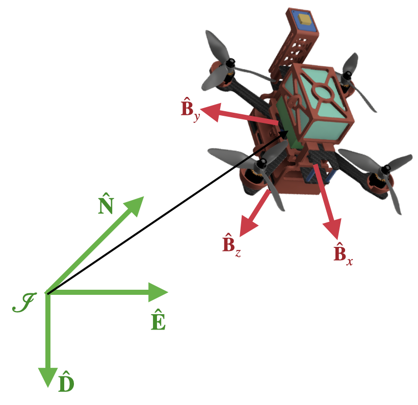
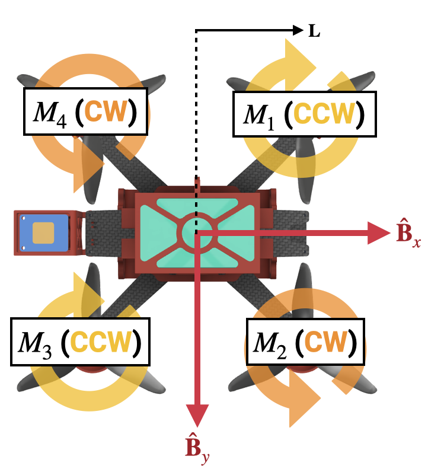

# Quadcopter from Scratch: 6DOF MATLAB Simulation

**Part 1 of building a quadcopter from "scratch"**

---

## Summary

This is <strong>Part 1</strong> of my quadcopter project. This part will go over all the theory and derivation of the Control, Estimation, and Dynamics of the system.  
This will culminate into a full 6DOF simulation in MATLAB completed with:  

• Sensor modeling w/ noise 

• Motor modeling w/ time delay

• LQR Controller for setpoint regulation (waypoint)

• 18-State Error-State Kalman Filter w/ Bias States 

• Closed-loop propagation through non-linear dynamics for end-to-end GNC validation

<strong>Introduction: </strong>  
Since this is the first part of hopefully many, the introduction to this project will be place here. I started this project to learn more about flight software and embedded hardware (specifcally converting simulation to real-time systems), as well as applying what I have learned from my first full-time job as a way to gauge my knowledge. Luckily, this project formed a symbiotic relationship with my current role working closely with one of the Aerocubes program, where I got the opportunities to deepen my understanding of the GNC concepts from my coursework through real world applications, which have now been reinforced and used here.  

Seeing as drones and satellites have nothing in common aside from the control and estimation theories, I should be safe from unknowingly using any sensitive knowledge. 

<strong>Disclaimer: </strong>  
The L1 goal for this project is to have a fully customized GNC system flying on a quadcopter. This means that I am not trying to build the best system, nor do anything particularly novel (yet). The focus for me is to learn more about GNC through a platform that is controllable and can be done at home after work (so no model rocket). I also make choices that may not be optimal to save on time, as even a couple hours of delay can result in several buisness days until I have the time to work on this again.  

I put the from "scratch" in quotation marks since having a full time job means it isn't feasible to learn every single discipline needed to fully do this all from zero. This means I use breakout boards for sensors with readily implemented libraries and prototyping boards to contain all my electronics (rather than commerically avaliable flight computer boards) to delay having to learn low level programming and PCB design (both of which I hope to do in the future).  

I avoided looking at any open sourced software like Betaflight and Ardupilot as to not be influenced by choices they make and wasting time learning their codebases, so if any unconventional design choices exists, that may be why.

---

## Table of Content
• <a href="#dynamic-model">Dynamic Model</a> 
  &nbsp;&nbsp;&nbsp;&nbsp;↳ <a href="#inertial-body-frame">Inertial & Body Frames</a> 
  &nbsp;&nbsp;&nbsp;&nbsp;↳ <a href="#force-torque-generation">Force and Torque Generation</a> 
    &nbsp;&nbsp;&nbsp;&nbsp;&nbsp;&nbsp;&nbsp;&nbsp;↳ <a href="#aerodynamic-relationships">Aerodynamic Relationships</a> 
    &nbsp;&nbsp;&nbsp;&nbsp;&nbsp;&nbsp;&nbsp;&nbsp;↳ <a href="#motor-conventions">Motor Conventions</a> 
    &nbsp;&nbsp;&nbsp;&nbsp;&nbsp;&nbsp;&nbsp;&nbsp;↳ <a href="#control-allocation">Control Allocation</a> 
  &nbsp;&nbsp;&nbsp;&nbsp;↳ <a href="#newton-quaterion-euler">Newton's Second Law, Quaternion Kinematics, and Euler's Rotation Equations</a> 

• <a href="#lqr-controller">LQR Controller</a> 
  &nbsp;&nbsp;&nbsp;&nbsp;↳ <a href="#regulation-with-quaternions">Regulation with Quaternions</a> 
  &nbsp;&nbsp;&nbsp;&nbsp;↳ <a href="#attitude-error-jacobian">Attitude Error / Jacobian</a> 

• <a href="#sensors">Sensors</a> 
  &nbsp;&nbsp;&nbsp;&nbsp;↳ <a href="#imu-model">IMU Model</a> 
  &nbsp;&nbsp;&nbsp;&nbsp;↳ <a href="#mag-model">Magnetometer Model</a> 
  &nbsp;&nbsp;&nbsp;&nbsp;↳ <a href="#gps-model">GPS Model</a> 
    &nbsp;&nbsp;&nbsp;&nbsp;&nbsp;&nbsp;&nbsp;&nbsp;↳ <a href="#lla-conversions">LLA Conversion</a> 
    &nbsp;&nbsp;&nbsp;&nbsp;&nbsp;&nbsp;&nbsp;&nbsp;↳ <a href="#ned-frame-conversions">NED Frame Conversions</a> 
  &nbsp;&nbsp;&nbsp;&nbsp;↳ <a href="#alt-model">Altimeter Model</a> 

• <a href="#error-state-kalman-filter">Error State Kalman Filter</a> 
  &nbsp;&nbsp;&nbsp;&nbsp;↳ <a href="nominal-error-state">Nominal vs Error State</a> 
  &nbsp;&nbsp;&nbsp;&nbsp;↳ <a href="rror-state-dynamics">Error State Dynamics</a> 
    &nbsp;&nbsp;&nbsp;&nbsp;&nbsp;&nbsp;&nbsp;&nbsp;↳ <a href="#alpha">Alpha</a> 
    &nbsp;&nbsp;&nbsp;&nbsp;&nbsp;&nbsp;&nbsp;&nbsp;↳ <a href="#position-error">Position Error</a> 
    &nbsp;&nbsp;&nbsp;&nbsp;&nbsp;&nbsp;&nbsp;&nbsp;↳ <a href="#velocity-error">Velocity Error</a> 
    &nbsp;&nbsp;&nbsp;&nbsp;&nbsp;&nbsp;&nbsp;&nbsp;↳ <a href="#bias-errors">Bias Errors</a> 

• <a href="#simulation-results">Simulation Results</a> 

• <a href="#conclusion">Conclusion</a> 

<h2 id="dynamic-model">Dynamic Model</h2>

As with any control and estimation problem, the starting point must be a model describing how the states of the system will evolve over time due to any imparted forces / torques:  
$$
\dot{x} = f(x,u) \tag{1}
$$
Where $x$ represents the state vector, and $u$ represents the control.  
The state will be the translational position ($p$) and velocity ($v$), along with the quaternion ($q$) and body rates ($\omega$).  
$$ x = \begin{bmatrix} p\\\ v \\\ q \\\ \omega\end{bmatrix} \tag{2}$$
The control will the magnitude of the total thrust ($F_T$), along with the torques along the 3 body axis ($^B \tau_x, ^B\tau_y, ^B\tau_z$). More on this choice of control later.  
$$ u = \begin{bmatrix} F_T\\\ ^B\tau_x \\\ ^B\tau_y \\\ ^B\tau_z\end{bmatrix} \tag{3}$$

<h3 id="inertial-body-frame">Inertial & Body Frames</h3>
Before getting any further, the inertial frame must be defined. For this project, it will follow the North East Down [$\hat{N}, \hat{E}, \hat{D}$] convention for its orthogonal axis. This means the identity quaternion represents the attitude when $\hat{B}_x$ aligns with $\hat{N}$, $\hat{B}_y$ aligns with $\hat{E}$,  and $\hat{B}_z$ aligns with $\hat{D}$.
<figure style="text-align: center;">
  
  <figcaption style="font-size: 0.9em">
    Figure 1: Drone inertial reference frame
  </figcaption>
</figure>

This results in some conventions like gravity being positive (along the +Z / Down axis), and needing to commanding a negative height in order to go "Up". While this doesn't impact the complexity of the math, it needs to be noted. If there seems like theres an extra negative sign or rotation seems off, its likely due to this convention. 

<h3 id="force-torque-generation">Force and Torque Generation</h3>

<h4 id="aerodynamic-relationships">Aerodynamic Relationships</h4>
Generally, thrust generated by each motor / propeller pair is described by the following relationship <a href="https://m-selig.ae.illinois.edu/props/propDB.html" target="_blank">[1]</a>:
$$ F_{T,i} = C_T \rho D^4 n_i^2 \tag{4}$$
where $C_T$ is the thrust coefficient, $\rho$ is the air density, $D$ is the diameter of the propeller, and $n_i$ is the spin rate in revolutions per second.

Additionally, each time the propeller accelerates, a torque must be applied to increase its angular momentum. By the conservation of angular momentum, the total angular momentum of the system must remain constant if there are no external torques acting on the system. This means that if the motor spins the propeller in one direction, the aircraft body will experience an equal and opposite torque to counteract it. This counteracting torque can be expressed as:
$$ \tau_i = C_\tau \rho D^5 n_i^2 \tag{5}$$
where $C_\tau$ is the torque coefficient.  

Higher fidelity simulations may model $C_T$ and $C_\tau$ as a function of the advance ratio and reynolds number, while $\rho$ as a function of the pressure ($P$) and temperature ($T$). However, without access to a wind tunnel, treating these values as constants works pretty well. This allows for the simplified relationships:
$$ \begin{align} F_{T,i} &= k_T n_i^2  \\
 \tau_i &= k_M n_i^2 \end{align} \tag{6}$$
where $k_T$ is the thrust constant, and $k_M$ is the torque / moment constant.

<h4 id="motor-conventions">Motor Conventions</h4>

With these relationships defined, it is clear why quadcopters spin their motors in very specific pairings which will be explained below. Firstly, for this project, the motor conventions are as follows:
<figure style="text-align: center;">
  
  <figcaption style="font-size: 0.9em">
    Figure 2: Motors Spin Directions (CW / CCW w.r.t. $\hat{B}_z$)
  </figcaption>
</figure>

<strong> Thrust / Yaw Torque</strong>  
If we want to increase or decrease the total vertical thrust, the four motors must spin together to sum up to the desired thrust ($F_T$). 

However, this doesn't necesarily constrain the spin direction of each motor nor the spin rates, which only comes about by considering torques. Starting with the "yaw", the axis of rotation for each motor is aligned along the $\hat{B}_z$ direction, meaning each revolution of the motors will sum up to a torque about that direction ($^B\tau_z$). 

From observation, in order to have independent control over the $F_T$, you must spin all four motors at the same rate and have equal numbers of CW and CCW motors such that  $^B\tau_z = 0$. This allows for control over $^B\tau_z$ by adjusting the speeds of the CW and CCW motor pairs, while maintaining the desired $F_T$.

<strong> Roll / Pitch Torque </strong>  

Now that we know how many motors must spin in each direction, the next step is figuring out the orientation of them with respect to each other. The answer here is that adjacent motors spin in opposite directions, while diagonal motors spins in the same direction as shown by Figure 2. 

In this configuration, if you wanted to roll about the $\hat{B}_x$ axis, you can increase the spin rates of the motor pair M1 and M4, while decreasing the spin rates of the motor pair M2 and M3 to maintain the desired thrust level.

The counteracting torques between M1/M4, aand M2/M3 will cancel each other out if they spin at the same rates, resulting in $^B\tau_z = 0$. And due to these pairs having the same moment arm from the $\hat{B}_y$ axis, the torques induced by the moment arms will also cancel out such that $^B\tau_y = 0$, resulting in independent control of $^B\tau_x$

The same logic applies for pitching about the $\hat{B}_y$ axis, except the motor pairs are now M1/M2, and M3/M4. 

<h4 id="control-allocation">Control Allocation</h4>

This results in the following mapping between our chosen control vector $u$ and the spin rates of the motors:

$$
\underbrace{
\begin{bmatrix}
F_T\\
^B\tau_x \\
^B\tau_y \\
^B\tau_z
\end{bmatrix}
}_{u}
=
\underbrace{
\begin{bmatrix}
k_T & k_T & k_T & k_T \\
Lk_T & -Lk_T & -Lk_T & Lk_T \\
Lk_T & Lk_T & -Lk_T & -Lk_T \\
-k_M & k_M & -k_M & k_M
\end{bmatrix}
}_{M}
\underbrace{
\begin{bmatrix}
n_1^2\\
n_2^2 \\
n_3^2 \\
n_4^2
\end{bmatrix}
}_{n^2}  \tag{7}
$$

where $M$ is the control allocation matrix. 

From here, the choice of control is hopefully clear, as $M$ allows for the mapping of the requested control to the desired spin rate of all four motors via a matrix inversion. 

<h3 id="newton-quaterion-euler">Newton's Second Law, Quaternion Kinematics, and Euler's Rotation Equations</h3>

Applying the three equations gives us the full dynamic model that will be used. 

$$
\dot{x} = f(x,u) = 
\begin{bmatrix}
v \\
R(q)^T\frac{^B\vec{F_T}}{m} u+ \vec{g}\\
\frac{1}{2} \begin{bmatrix} -\omega\cdot\vec{q} \\ q_w\omega - \omega \times\vec{q} \end{bmatrix} \\
J^{-1}*(-\omega \times J\omega + ^B\vec{\tau})
\end{bmatrix} \tag{8}
$$ 

where $^B\vec{F_T}$ represents the total thrust in the body frame ($^B[0; 0; F_T]$), R(q) is the rotation from the inertial frame to the body frame, $\vec{g}$ represents the gravity vector in the inertial frame ($^I[0; 0; g]$), $J$ is the moment of inertia matrix, and $^B\vec{\tau}$ represents the total torques around the body axis ($^B[\tau_x; \tau_y; \tau_z]$). 

The only force modeled will be from gravity and the thrust of the motors (ignoring drag). However, because the thrust is constrained along the $\hat{B}_z$ axis, it must be rotated into the inertial frame in order to properly apply Newton's Second Law. 

<h2 id="lqr-controller">LQR Controller</h2>

With the non-linear model, normally you can just taylor series expand about a equilibrium point to find your system matrices ($A$ & $B$). A typical point to linearize quadcopters around is the "hover" condition ($\bar{x}$ & $\bar{u}$), which means the states should be closed to the identity quaternion with zero body rates (position and velocity doesn't factor into the linearization), along with enough thrust to counteract gravity:
$$
A = I + \frac{\partial f(x,u)}{\partial x}\Big|_{\bar{x}, \bar{u}} \Delta t
$$
$$
B =\frac{\partial f(x,u)}{\partial u}\Big|_{\bar{x}, \bar{u}} \Delta t
$$
$$
\bar{x} = \begin{bmatrix}0; & 0; & 0; & 0; & 0; & 0; & 1; & 0; & 0; & 0; & 0; & 0; & 0 \end{bmatrix}
$$
$$
\bar{u} = \begin{bmatrix}mg; & 0; & 0; & 0\end{bmatrix}
$$

<h3 id="regulation-with-quaternions">Regulation with Quaternions</h3>

While this may seem straight forward, doing the steps above with the quaternion as part of the state vector will result in the system not having full controllability. This can be observed by forming the controllability matrix $C$: 
$$
C = \begin{bmatrix}B & AB & ... A^{n_x-1}B \end{bmatrix}
$$
where $n_x$ is the length of the state vector (13). 

The system is controllable if $C$ is full rank, which means $rank(C) = n_x = 13$, which is not the case. Instead, the rank of $C$ is 12 when linearized about a set point, meaning there is only 12 DOF for this system. The missing DOF comes from the unit-norm constraint on the quaternion. If this were a true regulation problem, you would want to drive all state to 0, which obviously cannot happen with the quaternion as it must maintain a magnitude of 1. 

But if we operate about the setpoint where the quaternion towards the identity quaternion, the scalar component would effectively be 1 and we can just regulate the vector part. Doing so would effectively shrink the DOF if this system by 1 and give us control over the remaining states, the only thing left is to mathemtically formalize this. 

The steps for doing will be shown here at a high level, but is explained in detail by this lecture from Prof. Manchester at CMU <a href="https://www.youtube.com/watch?v=gSeRXxaC5CM" target="_blank">[2]</a>:

<h3 id="attitude-error-jacobian">Attitude Error / Jacobian</h3>

Instead of using the full quaternion, the controller will be regulating a small attitude error $\alpha$. There are multiple representations that can be used, but the one chosen will be the vector component of the quaternion error ($\delta q$)
which is defined as follows:
$$
q_{ref} = \delta q \otimes q \rightarrow \delta q = q_{ref} \otimes q
$$
$$
\alpha = \delta q_{xyz}
$$

Where $\delta q$ represents a tiny error in rotation between our current attitude and the desired one, and $\alpha$ is simply the vector component of this. The operator $\otimes$ is the quaternion multiplication (Kronecker Product).

Using this definition, an attitude jacobian ($G(q)$) can be aquired that maps a small change in $\alpha$ to $\delta q$,linearized about the current attitude $q$. 
$$
G(q) = \begin{bmatrix} -q_x & -q_y & -q_z \\ q_w & q_z & -q_y \\ -q_z & q_w & q_z \\ q_y & -q_x & q_w \end{bmatrix} \tag{9}
$$  

With this defined, the system matrices can be shrunk to achieve the desired impacts mentioned above:
$$
E(q) = 
\begin{bmatrix} 
I_{3x3} & 0_{3x3}   & 0_{3x3}   & 0_{3x3}  \\
0_{3x3} & I_{3x3}   & 0_{3x3}   & 0_{3x3}  \\
0_{4x3} & 0_{4x3}   & G(q)      & 0_{4x3}  \\
0_{3x3} & 0_{3x3}   & 0_{3x3}   & I_{3x3}  \\
\end{bmatrix}
\rightarrow
\begin{align}
\tilde{A} &= E^T A E\\
\tilde{B} &= E^T B
\end{align}
$$
After linearizing the new system matrices ($\tilde{A}$ & $\tilde{B}$) about hover conditions, the rest of this controller follows the normal LQR steps (select gains $Q$, $R$, solve the Algebraic Riccati equation, obtain an optimal gain $K$). 

As a further note, the controllability test can be performed once again to verify that:
$$
\tilde{C} = \begin{bmatrix}\tilde{B} & \tilde{A}\tilde{B} & ... \tilde{A}^{\tilde{n}_x-1}\tilde{B} \end{bmatrix}
$$
Results in a system that is fully controllable, that is, $rank(\tilde{C}) = \tilde{n}_x = 12$.

<h2 id="sensors">Sensors</h2>
The sensor suite will consist of an IMU for high frequency measurements of the acceleration and body rates for propagation, fused with GPS, Altimeter, and Magnetometer data to provide updates for the position, velocity, and quaternion. 

<h3 id="imu-model">IMU Model</h3>

While there are many sources for the IMU, the main ones will be white noise and a random walk term to simulate bias growth (so ignoring any scale factor, non-orthogonality, $g / g^2$ sensitivity etc), resulting in the following models for the Accelerometer:
$$
^A\tilde{a}(t) = ^Aa_{A/I}(t) + ^Ab_a(t) - R_{I\rightarrow A}(t) ^I g + ^A\eta_a \tag{10}
$$
where $^A\tilde{a}(t)$ is the measured acceleration of the IMU, $^Aa_{A/I}(t)$ is the true net acceleration of the IMU, $^Ab_a(t)$ is the time varying bias of the accelerometer, $R_{I\rightarrow A}(t) ^I g$ is the rotated inertial gravity, and $^A\eta_a$ is the white noise, all expressed in the accelerometer frame.

And Gyro:
$$
^G\tilde{\omega}(t) = ^G\omega_{G/I}(t) + ^Gb_g(t) + ^G\eta_g \tag{11}
$$
where $^G\tilde{\omega}(t)$ is the measured rotational rate of the IMU,$^G\omega_{G/I}(t)$ is the true rotational rate of the IMU with respect to the inertial frame, $^Gb_g(t)$ is the time varying bias of the gyro (accelerometer measures with respect to free fall), and $^G\eta_g$ is the white noise, all expressed in the gyro frame.

For all intents and purposes, the Accelerometer and Gyro share the same frame, which is the IMU frame. 
The random walk term will be grouped into the bias model, rather than treated as being grouped with the noise.
While the white noise parameter can readily be found on the datasheets, the RRW parameter may not always show up on low cost hobbiest sensors. In this case, a RRW parameter was taken from a similar IMU with some added conservatism and verified with the sensor itself via an Allan Variance curve.  

<h3 id="mag-model">Magnetometer Model</h3>

A magnetometer measures the local magnetic field vector. If you point any of the axis directly along the magnetic field vector, only that axis would return a value, while the other two should be close to zero (with some noise). This results in the following model:
$$
^M\tilde{m} = R_{M\rightarrow I}(t) ^Im_{ref} + ^M\eta_m  \tag{12}
$$
where $^M\tilde{m}$ is the measured magnetic field vector, $R_{M\rightarrow I}(t) ^Im_{ref}$ is the rotated true magnetic field vector, and $^M\eta_m$ is some white noise term, all expressed in the Magnetometer frame.
The white noise term can be found on the magnetometer data sheet.

<h3 id="gps-model">GPS Model</h3>

While a typical GPS model for simulation could be the inertial position and velocity with some added noise, the actual GPS returns a "Sentence", which just is a string of characters containing the information. This typically comes in the form of Latitude, Longitude, Altitude, Speed over Ground (SOG), and Course over Ground (COG), which then must be converted into the associated states. Since this conversion is non-linear, the noise added at the state level vs the measurement level results in different effects. Since the noise terms are typically given on the state level (position / velocity $1-\sigma$), the steps for converting from the 5 measured quantities to the inertial position / velocities will be provided here. The sensor model would then be adding noise to the true states, and then inversing the steps to generate measurements (for the simulation, this is trivial since we could've just taken the noisy state, but the conversion was added to ensure it will be correct for FSW).

<h4 id="lla-conversions">LLA Conversion</h4>
Using the WSG84 Ellipsoid Model, which is what the Latitude, Longitude, and Altitude are in reference to, we can use the following conversion to obtain the conversion from LLA directly into a position vector in the Earth-Centered Earth-Fixed (ECEF) frame <a href="https://sioslab.com/wp-content/uploads/2021/09/MAE4060_Handouts.pdf#page=19" target="_blank">[3]</a>:
$$
\begin{bmatrix}x \\ y\\ z \end{bmatrix}_{ECEF}
=
\begin{bmatrix}
(a/(\sqrt{1-e^2sin^2(\phi)}) + h)cos(\phi)cos(\theta) \\
(a/(\sqrt{1-e^2sin^2(\phi)}) + h)cos(\phi)sin(\theta) \\
(a(1-e^2)/(\sqrt{1-e^2sin^2(\phi)}) + h)sin(\phi)
\end{bmatrix} \tag{13}
$$

where $a$ and $e$ are the semi-major axis and eccentricity of the earth under the WSG84 model, and $\phi$, $\theta$, $h$ are the Latitude, Longitude, and altitude respectively.  

<h4 id="ned-frame-conversions">NED Frame Conversions</h4>
Note that before this can be converted into the inertial frame of choice, there must be a reference vector that initializes the origin of the inertial frame on the ECEF frame, such that the deltas between the measured ECEF, and the reference ECEF vector is the position and velocity relative to the origin of the NED frame. 

$$
^{ECEF} r_{NED} = ^{ECEF} r_{ref} - ^{ECEF} r_{meas} \tag{14}
$$

From there, the rotation that describes the orientation of the ECEF frame to the local NED frame is required, which is dependent upon the reference LLA. This results in:
$$
^{NED} r_{NED}= R_{ECEF\rightarrow NED}^{ECEF} r_{NED}
$$
where $R_{ECEF\rightarrow NED}$ describes this rotation and is:
$$
R_{ECEF\rightarrow NED} = R_2(-\phi_{ref} - \frac{\pi}{2}) R_3(\theta_{ref}) \tag{15}
$$
This reads as starting with the ECEF, rotate the coordinate around the Z axis by the reference longitude. This aligns the Y axis with the East Direction. Another rotation about the X axis by the quantity of the reference latitude minus 90 degrees will align the Z with the down axis, and X with the North. 

These conversions can be summarized here <a href="https://en.wikipedia.org/wiki/Local_tangent_plane_coordinates#Local_north,_east,_down_(NED)_coordinates" target="_blank">[4]</a>. 

The datasheet typically gives the noise of the position in terms of a 50% CEP, which can be roughly translated into a $1-\sigma$ value via $\sigma = CEP_{50}/1.18$. The velocity 1-sigma is guess-stimated to be ~1 order of magnitude smaller since its not always provided. 

<h3 id="alt-model">Altimeter Model</h3>
The altimeter works by measuring pressure, and comparing it to the local pressure in order to a height. Since there are no plans to fly this to extreme altitudes, the following exponential model is sufficent:

$$
P = P_0 exp(\frac{-gMh}{RT_0}) + \eta_p\tag{16}
$$
where $P_0, T_0$ are the reference pressure and temperature, while $g, M, R$ are constants and are the gravity, mean molecular weight of air, and the ideal gas constant. $\eta_p$ represents the white noise added onto the pressure model.

The height can computed from a pressure reading, which will be used to compute the "Down" component of the inertial position:
$$
^{NED} z = h_0 - h\tag{17}
$$

where $^{NED} z$ is the z component of the position in the NED frame, and $h_0$ is the reference height at the start. 
Note that the sign here is reversed. This is because as the height coming out of the altimeter increases, $^{NED} z$ becomes more negative since it represents the DOWN direction. 

The white noise 1-sigma is readily avliable in data sheets.

<h2 id="error-state-kalman-filter">Error State Kalman Filter</h2>

With all the sensors defined, the next step is the fusion of all the measurements, along with the dynamic model to obtain the best estimate of the state given the expected uncertainties. 
The common option here is the standard Extended Kalman Filter, which is able to handle the non-linear dynamics of this system by linearizing about model about its current estimate. But as with the LQR controller, having the quaternion as part of the state with its unit-norm constraint causes some issues. Normally, during the update step when you obtain a meassurement, you additively update your state estimate:
$$
\hat{x}_{k}^+ = \hat{x}_k^- + K(z - H\hat{x}_k^-)
$$
However, doing so for the quaternion doesn't preserve the unit-norm constraint without manually normalizing after the update step, which maintains the constraint at the loss of some accuracy.  

Luckily NASA figured out how to get around this by reformulating the filter with the addition of error states. I refer to this as the Error-State Kalman Filter but it may be better known as the Multiplicative Extended Kalman Filter (MEKF). 
The main gist here is that between measurement updates, your estimate is incurring some amounts of error. This error is then rendered observable when you obtain a measurement and correct for it accordingly. On top being able to maintain the quaternion norm, error states are more likely to grow linearily between updates compared to the actual state, so the errors from mis-modling highly non-linear behaviors can be mitigated by keeping track of the error instead.

For more of the theory and math, I often refer to the thesis by J. Sola which includes the fundamentals and alternative design choices<a href="https://arxiv.org/pdf/1711.02508" target="_blank">[5]</a>. I also used this paper by J. Maley with applications to guided projectiles which I found to be more digestable with derivation of measurement models for the sensors in this project <a href="https://apps.dtic.mil/sti/tr/pdf/ADA588831.pdf" target="_blank">[6]</a>. 

An attempt at a high level summary will be provided below.

<h3 id="nominal-error-state">Nominal vs Error State</h3>

Within the filter, there will need to be a distinction between the nominal and error state. The nominal states are as follows:
$$
\hat{x} = \begin{bmatrix} p \\ v \\ q \\ \beta_{a} \\ \beta_{g} \\ \beta_{m} \end{bmatrix}
$$
where the states represents the position, velocity, quaternion, accelerometer bias, gyro bias, and magnetometer bias. 

The error states are:
$$
\delta x = \begin{bmatrix}\delta p \\ \delta v \\ \alpha \\ \delta \beta_{a} \\ \delta \beta_{g} \\ \delta \beta_{m} \end{bmatrix} 
$$

where the errors are that of the nominal states above. 

This part sees the re-introduction of $\alpha$ as a small error in the attitude, which is DIFFERENT from the definition in the LQR controller. While the definition in either one can be made to match, they were kept as seperate in order to be able to quickly verify the implementations symbolically with the sources they were aquired from. Additionally, it will be shown that the definition of $\alpha$ chosen here makes the math slightly cleaner, which can then be compared to the LQR and seen that the definition selected there also results in no additional factors in the calculations. 

It should also be noted that the nominal state has a length of 19, while the error state has a length of 18. 

<h3 id="error-state-dynamics">Error State Dynamics</h3>
The full error state dynamics are as follows:

$$
\begin{align}
\begin{bmatrix}
\dot{\delta p} \\
\dot{\delta v} \\
\dot{\alpha}  \\
\dot{\delta\beta_{a}}\\
\dot{\delta \beta_{g}}\\
\dot{\delta \beta_{m}}
\end{bmatrix}
&=
\begin{bmatrix}
0 & I_3 & 0 & 0 & 0 & 0 \\
0 & 0 & -R(\hat{q})^T[(a_{meas} - \beta_a)\times]  & -R(\hat{q})^T & 0 & 0\\
0 & 0 & -[\omega_{meas} - \beta_g] \times & 0 & -I_3 & 0 \\
0 & 0 & 0 & 0 & 0 & 0\\
0 & 0 & 0 & 0 & 0 & 0\\
0 & 0 & 0 & 0 & 0 & 0\\
\end{bmatrix}
\begin{bmatrix}
\delta p \\
\delta v \\
\alpha  \\
\delta\beta_{a}\\
\delta\beta_{g}\\
\delta\beta_{m}\\
\end{bmatrix}
+
\begin{bmatrix}
0 & 0 &0 & 0 & 0 \\
-R(\hat{q})^T & 0 & 0 & 0 & 0 \\
0 & -I_3 & 0 & 0 & 0\\
0 & 0 & I_3 & 0  & 0\\
0 & 0 & 0 & I_3  & 0\\
0 & 0 & 0 & 0  & I_3\\
\end{bmatrix}
\begin{bmatrix}
\eta_{a} \\
\eta_{g}\\
\eta_{\beta_a} \\
\eta_{\beta_g}\\
\eta_{\beta_m}\\
\end{bmatrix} \\ \\
\delta\dot{x}\hspace{6mm} &= \hspace{50mm} F \hspace{46mm} \delta x \hspace{5mm} +\hspace{25mm} G\hspace{30mm}w
\end{align}
$$

<h4 id="alpha">Alpha</h4>
The derivation steps here will be slightly different depending on how the error is defined, whether its a global or local error. In this case, it will be treated as a local error (Sola and Marley uses the global error), where the error quaternion represents:
$$
q_{I\rightarrow B} = \delta q_{B' \rightarrow B} \otimes \hat{q}_{I\rightarrow B'}  \tag{18}
$$
$$
\delta q = q \otimes \hat{q}^{-1} \tag{19}
$$
where $q_{I\rightarrow B}$ is the TRUE attitude describing the body frame relative to the inertial, $\hat{q}_{I\rightarrow B'}$ represents the ESTIMATED attitude describing the estimated body frame relative to the inertial frame, and $\delta q_{B' \rightarrow B}$ is the extra error that if known, would perfectly rotate the estimated body frame onto the truth. The goal is to then obtain a model that describes the change in error state given our estimated state with no reference to the truth. 

First, the derivative of the original expression is obtained by applying the chain rule:
$$ 
\dot{q} = \delta \dot{q} \otimes \hat{q} + \delta q \otimes \dot{\hat{q}} \tag{20}
$$

Then substituing in the quaternion derivative (which applies for both the estimated and truth):
$$
\dot{q} = \frac{1}{2} \begin{bmatrix} 0 \\ \omega \end{bmatrix} \otimes q \tag{21}
$$
where $\omega$ is the rate of rotation of the body frame relative to the inertial.

We obtain:
$$
\frac{1}{2} \begin{bmatrix} 0 \\ \omega \end{bmatrix} \otimes q = \delta \dot{q} \otimes \hat{q} + \delta q \otimes \frac{1}{2} \begin{bmatrix} 0 \\ \hat{\omega} \end{bmatrix} \otimes \hat{q} \tag{22}
$$
Now, replacing the true quaternion in terms of the error and estimate:
$$
\frac{1}{2} \begin{bmatrix} 0 \\ \omega \end{bmatrix} \otimes \delta q \otimes \hat{q} = \delta \dot{q} \otimes \hat{q} + \delta q \otimes \frac{1}{2} \begin{bmatrix} 0 \\ \hat{\omega} \end{bmatrix} \otimes \hat{q} \tag{23}
$$
And getting rid of the common factor by right multiplying ($\otimes \hat{q}^-1$), and solving for $\delta \dot{q}$:
$$
\delta \dot{q}  =  \frac{1}{2} ( \begin{bmatrix} 0 \\ \omega \end{bmatrix} \otimes \delta q -\delta q \otimes\begin{bmatrix} 0 \\ \hat{\omega} \end{bmatrix}) \tag{24}
$$
The only reference to the truth remaining is the body rates, which can be substitued for:
$$
\omega = \hat{\omega} + \delta\omega  \tag{25}
$$
where $\hat{\omega}$ is the measured rate (so the bias and noise of the sensor is baked into this term), while $\delta\omega$ is a tiny error in the body rates (which will be defined below).
Doing one final substitution:
$$
\begin{align}
			\delta \dot{q}  &=  \frac{1}{2} ( \begin{bmatrix} 0 \\ \hat{\omega} +\delta \omega \end{bmatrix} \otimes \delta q -\delta q \otimes\begin{bmatrix} 0 \\ \hat{\omega} \end{bmatrix}) \\
		& = \frac{1}{2} ( \begin{bmatrix} 0 \\ \hat{\omega}\end{bmatrix} \otimes \delta q -\delta q \otimes\begin{bmatrix} 0 \\ \hat{\omega} \end{bmatrix} + \begin{bmatrix} 0 \\ \delta{\omega}\end{bmatrix} \otimes \delta q)  
	\end{align} \tag{26}
$$
And simpliying using the following relationships:
$$
	\begin{align}
		\bar{q} \otimes q &= \begin{bmatrix}\bar{q}_w q_w - \bar{q}_{xyz}\cdot q_{xyz} \\q_w\bar{q}_{xyz} + \bar{q}_w q_{xyz} - \bar{q}_{xyz} \times q_{xyz}\end{bmatrix} \\
		\delta q &= \begin{bmatrix}1 \\ \delta q_{xyz} \end{bmatrix}
		\end{align}  \tag{27}
$$
where the first is simply the definition of the quaternion product, and the second represents the definition of a small quaternion error (scalar component is 1, vector components are close to 0).

We end up getting:
$$\begin{align}
		\delta \dot{q} &= \frac{1}{2} ( \begin{bmatrix} -\hat{\omega}\cdot \delta q_{xyz} \\ \hat{\omega} - \hat{\omega} \times \delta q_{xyz}\end{bmatrix}  -\begin{bmatrix} -\hat{\omega}\cdot \delta q_{xyz}\\ \hat{\omega} - \delta q_{xyz}  \times  \hat{\omega}\end{bmatrix} + \begin{bmatrix} -\delta{\omega}\cdot \delta q_{xyz} \\ \delta{\omega} - \delta{\omega} \times \delta q_{xyz}\end{bmatrix})  \\
		\delta \dot{q} &= \frac{1}{2} ( \begin{bmatrix}0 \\ -2 \hat{\omega} \times \delta q_{xyz}\end{bmatrix}+ \begin{bmatrix} -\delta{\omega}\cdot \delta q_{xyz} \\ \delta{\omega} - \delta{\omega} \times \delta q_{xyz}\end{bmatrix}) \\
		&\approx  \begin{bmatrix}0 \\ - \hat{\omega} \times \delta q_{xyz}\end{bmatrix}+ \frac{1}{2}\begin{bmatrix} 0 \\ \delta{\omega}\end{bmatrix}
	\end{align} \tag{28}
$$
which resulted from carrying out all the dot and cross products, and assuming that any $\delta$ terms are tiny, so their products are negligible. 

Since the entire scalar component in that expression is 0, it can be ignored, showing that the error dynamics will only be dependent upon the vector component:
$$
		\begin{align}
		\delta\dot{q}_w &= 0 \\
		\delta\dot{q}_{xyz} &= -\hat{\omega} \times \delta q_{xyz} + \frac{1}{2}\delta \omega
	\end{align} \tag{29}
$$

Now here is where the introduction of Alpha comes in:
$$
\alpha = 2\delta_{xyz} \tag{30}
$$
This was chosen such that when substituted back into the expression above, the coefficents cancels out and we just get:
$$
\dot{\alpha} =  -\hat{\omega} \times \alpha  + \delta \omega \tag{31}
$$

And to be more explicit, the gyro sensor model written in terms of the truth, estimated, and error states:
$$
\omega = \hat{\omega} - \delta \beta_g - \eta_g \tag{32}
$$
where $\delta \beta_g$ is a small error in the true bias, and $\eta_g$ is some white noise term.

Defining $\hat{\omega} = \omega_{meas} - \hat{\beta}_g$ (best estimate of body rates is measured subtracted by the estimated bias), and $\delta \omega = - \delta \beta_g - \eta_g$ (bias term is negative since we subtracted the estimated bias which has some error, and the sign on the white noise is arbitrary), we get the final equation to be:

$$
\dot{\alpha} =  -(\omega_{meas} - \hat{\beta}_g) \times \alpha - \delta \beta_g - \eta \tag{33}
$$

<h4 id="position-error">Position Error</h4>
The position error is defined as:
$$
\begin{align}
r &= \hat{r} + \delta{r}\\
\delta{r} &= r - \hat{r}
\end{align}
$$
Taking the derivative:
$$
	\begin{align}
	\delta\dot{r} &= \dot{r} - \dot{\hat{r}} \\
	&= v - \hat{v} = \delta v
	\end{align}
$$
Results in: 
$$
\delta\dot{r} = \delta v \tag{34}
$$

<h4 id="velocity-error">Velocity Error</h4>
The velocity error is defined as:
$$
\begin{align}
v &= \hat{v} + \delta v \ \\ 
\delta{v} &= v-\hat{v}  \
\end{align}
$$
Taking the derivative: 

$$\delta{\dot{v}} = \dot{v}-\dot{\hat{v}} \tag{35}$$ 

We know that :

$$ 
\dot{v} = R(q)^T f + g $$
$$\dot{\hat{v}} = R(\hat{q})^T \hat{f} + g  \tag{36} $$

which states that the acceleration in the inertial frame is the specific force (not accounting for gravity) in the body frame rotated into the inertial frame plus gravity.

Substituting $(36)$ into $(35)$:

$$\delta{\dot{v}} = R(q)^T f -R(\hat{q})^T \hat{f}  \tag{37}$$ 

Introducing the following properties:
$$
\begin{align}
R(q) &= (q_w^2 - |q_{xyz}|^2)I_3 - 2q_w[q_{xyz}\times] + 2q_{xyz}q_{xyz}^T \\
 &= 
	\begin{bmatrix}
	1 - 2(q_y^2+q_z^2) & 2(q_xq_y+q_zq_w) & 2(q_xq_z-q_yq_w)\\
	2(q_yq_x-q_zq_w) & 1-2(q_x^2+q_z^2) & 2(q_yq_z+q_xq_w) \\
	2(q_zq_x+q_yq_w) & 2(q_zq_y-q_xq_w) & 1-2(q_x^2+q_y^2)
\end{bmatrix}\\
R(\bar{q} \otimes q) &= R(\bar{q})R(q) \\
[\omega \times] &= \begin{bmatrix}0 & -\omega_3 & \omega_2 \\ \omega_3 & 0 & -\omega_1 \\ -\omega_2 & \omega_1 & 0 \end{bmatrix}
\end{align}$$
which are used to get the following approximation:
$$
R_{I\rightarrow B}(q)=R(\delta q \otimes \hat{q}) = R_{B^{\prime} \rightarrow B}(\delta q) R_{I\rightarrow B^{\prime}}(\hat{q})
$$
$$
\begin{align}
R_{B^{\prime} \rightarrow B}(\delta q) &\approx 
\begin{bmatrix}
1 & 2\delta q_z & -2\delta q_y \\
-2\delta q_z & 1 & 2 \delta q_x \\
2 \delta q_y & -2 \delta q_x & 1
\end{bmatrix} \\
&=(I_3 - 2[\delta q_{xyz}\times]) \\
&=(I_3 -[\alpha \times])  \tag{38}
\end{align} 
$$
$$
\begin{align}
R_{I\rightarrow B}(q) ^T &=  [R(\delta q)R(\hat{q})]^T \\ &= R(\hat{q})^T R(\delta q)^T
\\ &\approx R(\hat{q})^T(I_3 + [\alpha \times]) \tag{39}
\end{align} 
$$

$(37)$ can then be rewritten in terms of our error states:
$$
\delta v \approx R(\hat{q})^T(I_3 + [\alpha \times])f - R(\hat{q})^T \hat{f}  \tag{40}
$$

The only reference to the truth remaining is the specific force, which can be substitued for:
$$
f = \hat{f} + \delta f  \tag{41}
$$
$$
\delta v \approx R(\hat{q})^T(I_3 + [\alpha \times]) (\hat{f} + \delta f)  - R(\hat{q})^T \hat{f} \tag{42}
$$
Distributing the first term, combining like terms, and assuming that $\alpha * \delta f \approx 0$:
$$
\delta v \approx R(\hat{q})^T([\alpha \times]) \hat{f}  + R(\hat{q})^T\delta f\tag{43}
$$
Since we want this to be linear with the error state, we need to flip the operations of the cross product:
$$
\delta v = -R(\hat{q})^T([\hat{f} \times]) \alpha  + R(\hat{q})^T\delta f\tag{43}
$$

And to be more explicit, the accelerometer sensor model written in terms of the truth, estimated, and error states:
$$
f = \hat{f} - \delta \beta_a - \eta_a \tag{44}
$$
where $\delta \beta_a$ is a small error in the true bias, and $\eta_a$ is some white noise term.

Defining $\hat{f} = a_{meas} - \hat{\beta}_a$, and $\delta f = - \delta \beta_a - \eta_a$, we get the final equation to be:

$$
\delta v = -R(\hat{q})^T([ (a_{meas} - \beta_a) \times]) \alpha  + R(\hat{q})^T(-\delta \beta_a - \eta_a) \tag{45}
$$

<h4 id="bias-errors">Bias Errors</h4>
All the biases are assumed to have some random growth that is not propagated as part of the dynamics, but instead treated as part of the process noise, such that the covariance can account for the uncertainties and update the errors when a measurement is processed. This means that the biases "dynamics" are described as:
$$
\begin{align} 
\delta \dot{\beta}_a &= \eta_{\beta_a} \\
\delta \dot{\beta}_g &= \eta_{\beta_m} \\
\delta \dot{\beta}_m &= \eta_{\beta_m} 
\end{align}
$$
where the respective $\eta$ is the random growth rate, which can be modeled as a random walk. 

<h2 id="simulation-results">Simulation Results</h2>
<h2 id="conclusion">Conclusion</h2>

<section id="references" class="references">
  <h2>References</h2>
  <ol>

<li id="cite-propdb">
  Brandt, J. B., Deters, R. W., Ananda, G. K., Dantsker, O. D., & Selig, M. S., 
  <i>UIUC Propeller Database</i>, UIUC Department of Aerospace Engineering
  
    <a href="#cite-propdb-ref" title="Back to main text">↑</a>
   
  <a href="https://m-selig.ae.illinois.edu/props/propDB.html" target="_blank">
    https://m-selig.ae.illinois.edu/props/propDB.html
  </a>
</li>

<li id="cite-quatOpt">
  Z. Manchester, 
  <i>“Optimal Control and Reinforcement Learning Lecture 14”</i>, CMU Robotic Exploration Lab
  
    <a href="#cite-quatOpt-ref" title="Back to main text">↑</a>
   
  <a href="https://www.youtube.com/watch?v=gSeRXxaC5CM" target="_blank">
    https://www.youtube.com/watch?v=gSeRXxaC5CM
  </a>
</li>

<li id="cite-savransky">
  D. Savransky, 
  <i>“Spaceflight Mechanics Lecture Notes”</i>, Cornell University Space Imaging and Optical Systems Lab
  
    <a href="#cite-savransky-ref" title="Back to main text">↑</a>
   
  <a href="https://sioslab.com/wp-content/uploads/2021/09/MAE4060_Handouts.pdf#page=19" target="_blank">
    https://sioslab.com/wp-content/uploads/2021/09/MAE4060_Handouts.pdf#page=19
  </a>
</li>

<li id="cite-wiki-tangentplanes">
  Wikipedia, <i>“Local tangent plane coordinates”</i>.
  
    <a href="#cite-wiki-tangentplanes-ref" title="Back to main text">↑</a>
   
  <a href="https://en.wikipedia.org/wiki/Local_tangent_plane_coordinates#Local_north,_east,_down_(NED)_coordinates" target="_blank">
    https://en.wikipedia.org/wiki/Local_tangent_plane_coordinates
  </a>
</li>
<li id="cite-sola">
  J. Sola, <i>“Quaternion kinematics for the error-state Kalman filter”</i>.
  
    <a href="#cite-sola-ref" title="Back to main text">↑</a>
   
  <a href="https://en.wikipedia.org/wiki/Local_tangent_plane_coordinates#Local_north,_east,_down_(NED)_coordinates" target="_blank">
    https://en.wikipedia.org/wiki/Local_tangent_plane_coordinates
  </a>
</li>

<li id="cite-marley">
  J. Maley, <i>“Multiplicative Quaternion Extended Kalman Filtering for
  Nonspinning Guided Projectiles”</i> , ARL Weapons and Materials Research Directorate
  
    <a href="#cite-marley-ref" title="Back to main text">↑</a>
   
  <a href="https://en.wikipedia.org/wiki/Local_tangent_plane_coordinates#Local_north,_east,_down_(NED)_coordinates" target="_blank">
    https://en.wikipedia.org/wiki/Local_tangent_plane_coordinates
  </a>
</li>

  </ol>
</section>

