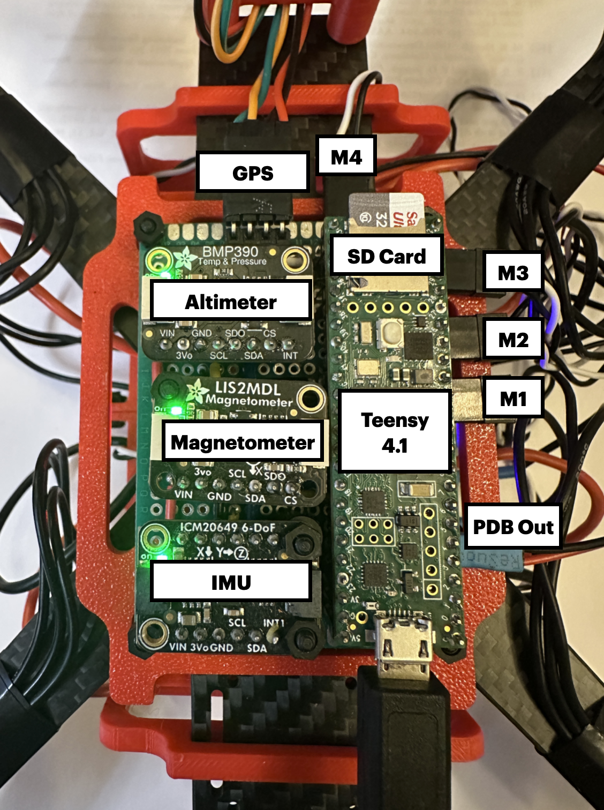
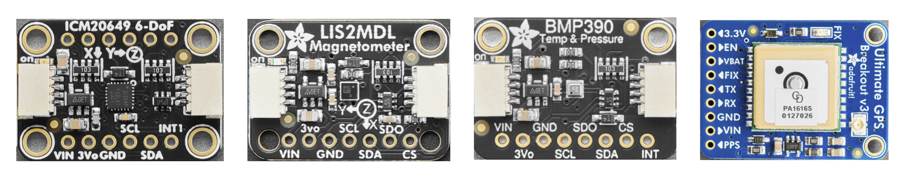
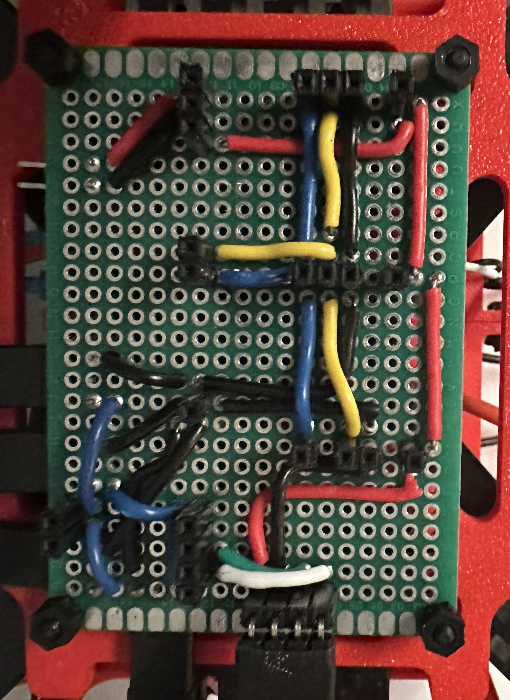
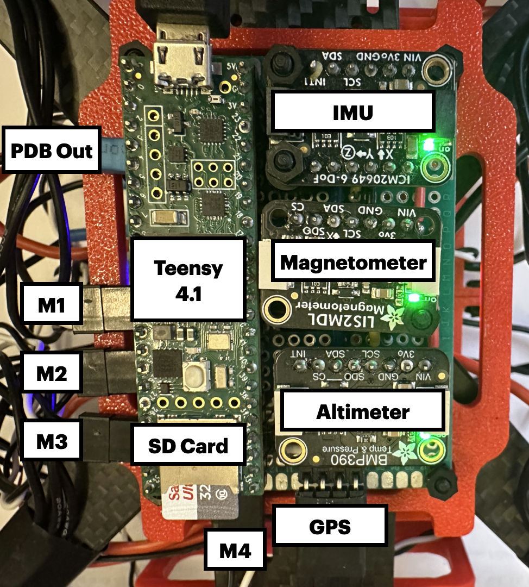
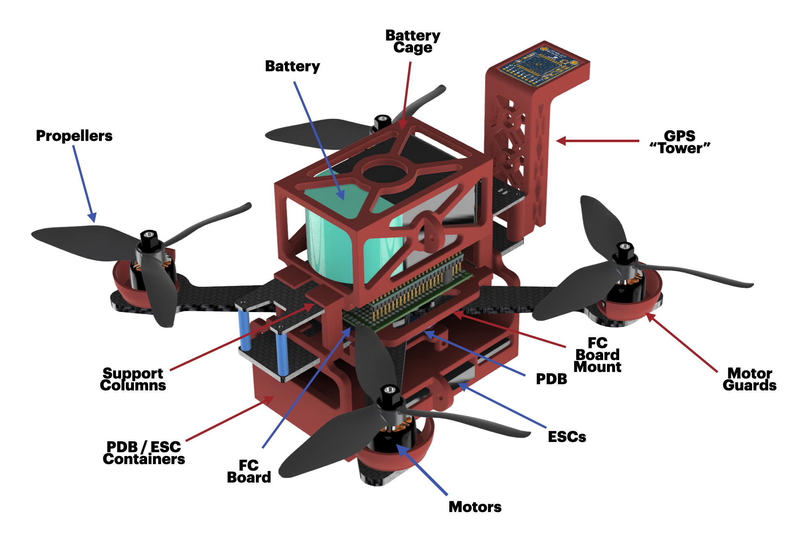
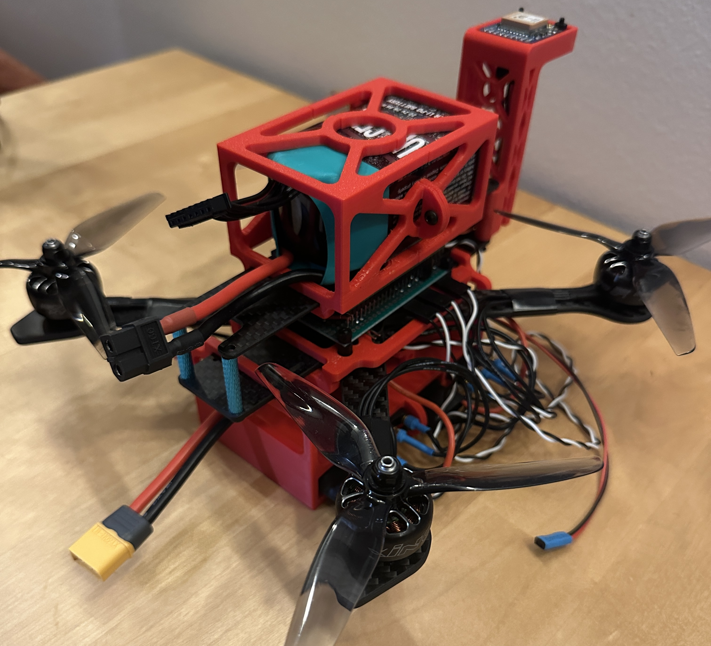
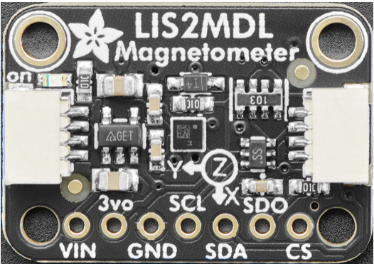
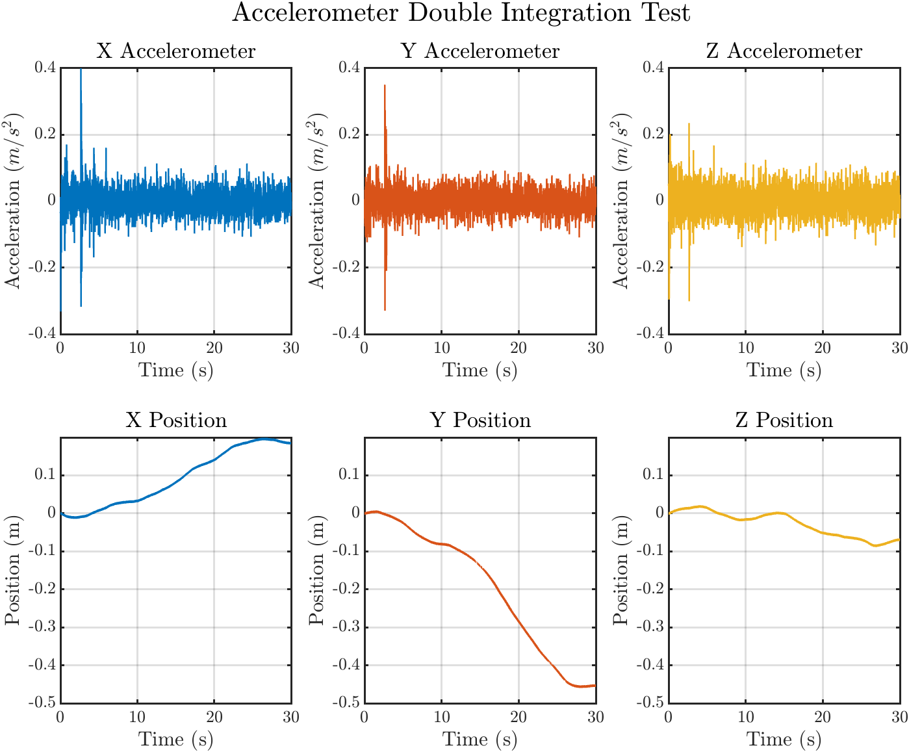
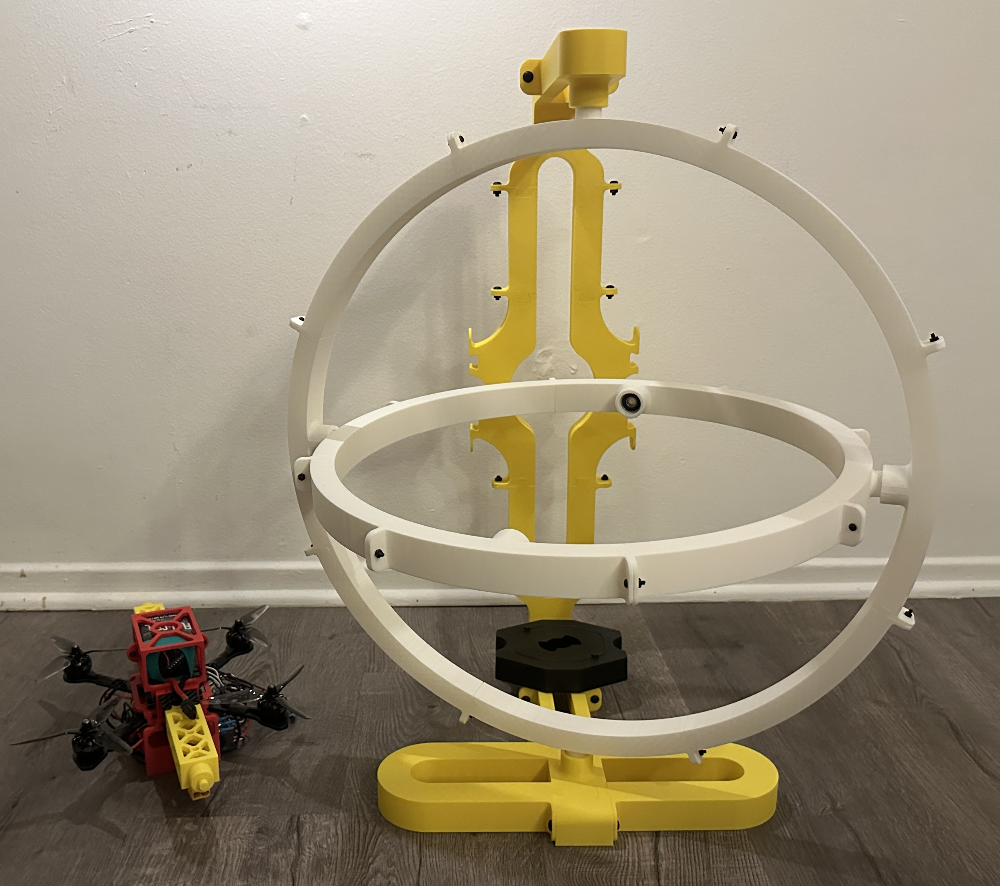
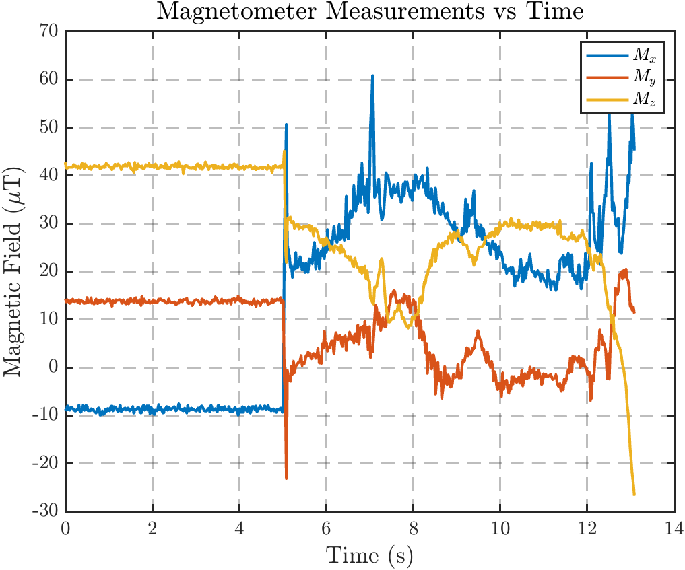

# Quadcopter Project: Flight Software
**Part 2 of building a quadcopter**  
<a href="https://github.com/ex33/drone_sim" class="tag tag-big">GITHUB</a>
---

<figure style="text-align: center;">
  
  <figcaption style="font-size: 0.8em">
    Flight Computer Board
  </figcaption>
</figure>

## Summary
This is <strong>Part 2</strong> of my quadcopter project. This part will go over the transition from my 6DOF MATLAB simulation in the previous part onto hardware. 

I will go over the sensor boards selected, major modules on the FSW, software system architecture decisions, some physical integration discussions, testing and verification, and any other challenges that arised. 

At this point, I still need to take the drone outdoors for further validations, but the testing I have done indoors on the attitude reference tracking demonstrates to me that the system has about 80% of the features needed. I am confident in the filter being correct, and that the controller is calculating the right outputs. The attitude controller plays a large role in the stability of the quadcopter, so I am fairly confident this will work in a closed loop manner.

This was the status of my FSW as of [2/21/2026]

## Table of Content
• <a href="#overview">Overview</a> 

• <a href="#sensor-breakout-boards">Sensor Breakout Boards</a> 

• <a href="#flight-software">Flight Software</a> 
  &nbsp;&nbsp;&nbsp;&nbsp;↳ <a href="#modules">Modules</a> 
    &nbsp;&nbsp;&nbsp;&nbsp;&nbsp;&nbsp;&nbsp;&nbsp;↳ <a href="#math-module">Math Module</a> 
    &nbsp;&nbsp;&nbsp;&nbsp;&nbsp;&nbsp;&nbsp;&nbsp;↳ <a href="#sensors-module">Sensors Module</a> 
    &nbsp;&nbsp;&nbsp;&nbsp;&nbsp;&nbsp;&nbsp;&nbsp;↳ <a href="#navigation-module">Navigation Module</a> 
    &nbsp;&nbsp;&nbsp;&nbsp;&nbsp;&nbsp;&nbsp;&nbsp;↳ <a href="#control-module">Control Module</a> 
    &nbsp;&nbsp;&nbsp;&nbsp;&nbsp;&nbsp;&nbsp;&nbsp;↳ <a href="#motors-module">Motors Module</a> 
    &nbsp;&nbsp;&nbsp;&nbsp;&nbsp;&nbsp;&nbsp;&nbsp;↳ <a href="#logger-module">Logger Module</a> 
    &nbsp;&nbsp;&nbsp;&nbsp;&nbsp;&nbsp;&nbsp;&nbsp;↳ <a href="#finite-state-machine-module">Finite State Machine Module</a> 
  &nbsp;&nbsp;&nbsp;&nbsp;↳ <a href="#system-archetecture">System Archetecture</a> 
    &nbsp;&nbsp;&nbsp;&nbsp;&nbsp;&nbsp;&nbsp;&nbsp;↳ <a href="#void-loop">void loop()</a> 
    &nbsp;&nbsp;&nbsp;&nbsp;&nbsp;&nbsp;&nbsp;&nbsp;&nbsp;&nbsp;&nbsp;&nbsp;↳ <a href="#sensors-navigation-loop">Sensors/Navigation Loop</a> 
    &nbsp;&nbsp;&nbsp;&nbsp;&nbsp;&nbsp;&nbsp;&nbsp;&nbsp;&nbsp;&nbsp;&nbsp;↳ <a href="#finite-state-machine-loop">Finite State Machine Loop</a> 
    &nbsp;&nbsp;&nbsp;&nbsp;&nbsp;&nbsp;&nbsp;&nbsp;&nbsp;&nbsp;&nbsp;&nbsp;↳ <a href="#control-motors-loop">Control/Motors Loop</a> 
    &nbsp;&nbsp;&nbsp;&nbsp;&nbsp;&nbsp;&nbsp;&nbsp;&nbsp;&nbsp;&nbsp;&nbsp;↳ <a href="#logger-loop">Logger Loop</a> 

• <a href="#integration">Integration</a> 

• <a href="#testing">Testing</a> 
  &nbsp;&nbsp;&nbsp;&nbsp;↳ <a href="#cross-checking-simulation">Cross Checking Simulation</a> 
    &nbsp;&nbsp;&nbsp;&nbsp;&nbsp;&nbsp;&nbsp;&nbsp;↳ <a href="#magnetometer-issues">Magnetometer Issues</a> 
    &nbsp;&nbsp;&nbsp;&nbsp;&nbsp;&nbsp;&nbsp;&nbsp;↳ <a href="#double-integration-issues">Double Integration Issues</a> 
    &nbsp;&nbsp;&nbsp;&nbsp;&nbsp;&nbsp;&nbsp;&nbsp;↳ <a href="#to-estimate-or-not-to-estimate-bias">To estimate or not to estimate (bias)?</a> 
  &nbsp;&nbsp;&nbsp;&nbsp;↳ <a href="#attitude-test-stand">Attitude Test Stand</a> 
    &nbsp;&nbsp;&nbsp;&nbsp;&nbsp;&nbsp;&nbsp;&nbsp;↳ <a href="#test-1">Test 1</a> 
    &nbsp;&nbsp;&nbsp;&nbsp;&nbsp;&nbsp;&nbsp;&nbsp;↳ <a href="#test-2">Test 2</a> 
    &nbsp;&nbsp;&nbsp;&nbsp;&nbsp;&nbsp;&nbsp;&nbsp;↳ <a href="#test-3">Test 3</a> 
    &nbsp;&nbsp;&nbsp;&nbsp;&nbsp;&nbsp;&nbsp;&nbsp;↳ <a href="#test-4">Test 4</a> 
    &nbsp;&nbsp;&nbsp;&nbsp;&nbsp;&nbsp;&nbsp;&nbsp;↳ <a href="#test-5">Test 5</a> 

• <a href="#whats-next">What's Next</a> 

<h2 id="overview">Overview</h2>
My FSW is written in C++ using the Platform.io extension on VSCode. 

Platform.io is a development ecosystem for embedded systems, which handles the compiler, dependencies, library managers, and provides a testing / debugging feature. Since my board was a Teensy 4.1., either the Arduino IDE or Platform.io is supported, but I was trying to ensure I had access to as many tools as I could to make this transition seamless. Platform.io also promotes a more standard codebase structure, with your includes, source files, libraries, testing, etc, while Ardiuno typically is for monolithic code that doesn't scale super well.

However, I am still using the Ardiuno framework inside of Platform.io. The majority of my modules do not rely on this, as its mostly for interfacing with the pre-existing libraries for my sensors. In the future if I choose to switch, I should be able to transition with minimal changes to the majority of my code.

I am also still in the process of fleshing out the flight safety and Finite State Machine (FSM) to ensure that the system is robust enough to start conducting testing outside. This includes things like safe modes for tilting too far, or exiting outside some pre-determined bounding box. Ideally, this would be robust enough that I can take it outside and safely test knowing that if anything off-nominal occurs, my FSM would be able to handle it accordingly. However, in the interest of time, I will be hard-coding some select behaviors, and evolving it as needs arises.

<h2 id="sensor-breakout-boards">Sensor Breakout Boards</h2>
All my sensors are from Adafruit, which provided the sensors that I needed in convenient breakout boards for me to plug straight into my breadboard for testing. It also was extremely attractive that Adafruit has accompanying libraries for their sensors that are easily implementable to get outputs as soon as the board is plugged in. 

My sensor suite includes the following:

• IMU: ICM20649  
• Magnetometer: LIS2MDL  
• Barometric Altimeter: BMP390  
• GPS: MTK3333  

<figure style="text-align: center;">
  
  <figcaption style="font-size: 0.9em">
    Figure 1: Sensor Breakout Boards Side-by-side
  </figcaption>
</figure>

There isn't much to talk about on the selection, as the GPS, Barometric Altimeter, and Magnetometer were whats avaliable at the time on their website. Some of the key features are as follows:

• The GPS board is able to run up to 10Hz and 66 channels.  
• The Altimeter has a relative accuracy of +/- 0.25m of accuracy with settings in the datasheet for Quadcopter applications (internal filter setting and output rates) 
• The Magnetometer is pretty standard, being able to run at a fequency much higher than needed (up to 3.4 MHz) while having relatively low current draw (4mA). 

I did end up selecting this specific IMU due to the larger range of acceleration and rotational rates it could record, with a max of +/- 30g for acceleration, and up to 4000dps for rates. Typically, IMUs at this price range would only go up to half of these ranges. This is definitely overkill for my quadcopter, but I wanted the flexibility to explore more aggressive applications in the future (and have a "Do-It-All" chip for transfering to other projects).

Additionally, there was the option to select a 9DOF IMU + Magnetometer board, which I ended up not choosing as it included some firmware that is able to accomplish attitude estimation for you. I had no real interest in this feature so it would've just been taking up extra processing in the background. The two sensors (IMU & Magnetometer) also had different use cases within my Error-State Kalman Filter (ESKF), so I liked the ability of being able to mix and match between the two and keeping them seperated. In the future, I would absolutely consider a chip that has the two packaged into one once I get more involved with board design. 

<h2 id="flight-software">Flight Software</h2>
This section will be all about the code. I will try to give an overview of each of the modules and their purposes, followed by some system level architecture decisions. 

<h3 id="modules">Modules</h3>
Below is an overview of all my modules, which are under drone_flight_software/lib.

There are 7 main modules:

• <a href="#math-module">Math</a>   
• <a href="#sensor-module">Sensors</a>  
• <a href="#navigation-module">Navigation </a>  
• <a href="#control-module">Control </a>  
• <a href="#motors-module">Motors </a>  
• <a href="#Logger-module">Logger </a>  
• <a href="#finite-state-machine-module">Finite State Machine </a>  

<h4 id="math-module">Math Module</h4>
This contains header only files for my math related containers. 

Within here, I have classes for: 

• Matrix18f [18x18]  
• Matrix9f [9x9]  
• Vector3f [3x1]  
• Quaternion  
• Rotation  

As the names implies, these are my implementations for common functions I need for each of the containers. For example, my matrix classes must be able to be zero-ed out or set to identity, handle standard math operations (add,subtract,multiply), along with all the standard operations (copy assignment, indexing elements, etc).

My vector class is only really there to go along with my Rotation classes, which is really a special implementation of a 3x3 matrix. And of course, I have a quaternion class for convenience as that is my attitude representation. 

Within this module, I also have a "Mathpk.h" file, where I import all the math container header files. This files exists for two main reasons. The first being an easy way to import all the math containers without having to do individual includes. Second, I depend any interactions between my classes here. For vectors, this includes dot and cross products. For quaternions, this includes some helper functions to do quaternion multiplication and propagation. I could've placed each of these within the classes themselves, but at the time, I thought this would be more clear and allows for each header to not have to import the other ones (although admittedly, this was added later so some of my classes may not strictly follow this, particularly Quaternion and Rotation).

<h4 id="sensors-module">Sensors Module</h4>
This is one of the bigger modules I have, and was actually the first part of the software I wrote. This takes care of the interfaces between my hand-written libraries, and the ones provided by Adafruit. 

At the very top, I import all of my Adafruit header files, which gives me access to create instances of their classes that contains each sensors:

//===== Adafruit =====
#include &lt;Adafruit_Sensor.h&gt;

// IMU
#include "ICM20649.h"

// Magnetometer
#include &lt;Adafruit_LIS2MDL.h&gt;

// Altimeter
#include &lt;Adafruit_BMP3XX.h&gt;

// GPS
#include &lt;Adafruit_GPS.h&gt;

The only sensor that doesn't use the Adafruit library is the IMU (ICM20649). I ended re-writing this due to the Adafruit library providing a latency of 3000 micro-seconds (~333Hz) just to access the data. I was able to get this down to 1400 micro-seconds (~714Hz) which isn't as fast as I would like, but seemed to be sufficent. I opted to not do this for the other sensors yet as their latencies were <1000 microseconds (1000Hz) and I didn't see orders of magnitude of improvements from the IMU. Thus, I didn't think it was worth digging through every data-sheet for all the registers (which I will once I complete the PCB design). 

Going back to the module, there are lot of functions at a glance, but at the very top will be my initializer along with my general functions for this class (checkout, calibrate, setup). This is then followed by specific functions for my IMU, Magnetometer, Altimeter, and GPS in that order. 

For each sensor type, there will be 1-3 functions that sets up the measurement ranges, update rates, internal bit settings, and more. These can easily be identified by looking at the inputs and seeing some non-standard parameter that typically comes from one of the header files above. 

For each sensor, there will be the following 3 functions:

bool sensorUpdate(uint32_t now);
float getSensorMeas();
float processSensorMeas(float sensorMeas);

Each sensor keeps track of when it was last updated in order to ensure that a stale measurement isn't being extracted and treated as new. The "sensorUpdate" will take in the current time, and if the difference between that and the last time the sensor was updated is greater than the user inputted frequency (should be the same one the ODR is set to or slower), then this goes will update the current measurement by calling "getSensorMeas", and return TRUE to signal a measurement is ready. 

Since this is just getting the RAW measurement straight from the register (plus whatever processing Adafruit does), there needs to be some additional operations to ensure the measurement will be handed to the filter as expected. This includes stuff like frame conversions from the sensor frame to the body frame, subtracting off any start-up biases, applying Soft/Hard iron calibration for the magnetometer, conversion from pressure to height for the altimeter, and the associated GPS outputs into the corresponding position and velocity in our inertial frame. 

The remaining functions are helpers that are used for calculations associated with post processing (which are translated from my simulation). Within the sensor stuff, the only parts that actually relies on Adafruit libraries are all the functions that sets the setting for the sensors and getSensorMeas, the rest are functions I wrote for interfacing, making this module still very portable if I ever wanted to move away from these libraries.

<h4 id="navigation-module">Navigation Module</h4>
After the sensor module, the next one I wrote was naturally my Navigation / State Estimation module, which contains my ESKF. 

Within the prediction step, there are the following relevant functions:

void predict(const std::array&lt;float,6&gt; imuMeas, uint32_t now);
void propagateCovariance(const Quaternion& q, const Vector3f& accelBias, const Vector3f& gyroBias, const Vector3f& accelMeas, const Vector3f& gyroMeas, const float dt);
Matrix18f getQd(float dt);
Matrix18f getSTM(const Quaternion& q, const Vector3f& accelBias, const Vector3f& gyroBias, const Vector3f& accelMeas, const Vector3f& gyroMeas, const float dt) const;

The "predict" function propagates the state and covariance, and is the only one accessed within the main loop, while the others are functions that are internally called. 

The filter does Dynamic Model Replacement / Dead-Reckoning, which just means it uses the IMU measurements as part of the dynamic model. When called, the current IMU measurement and current time must be provided. The filter will use the current time and its internal record of the last time its at in order to determine the timestep to propagate things by. 

After propagating the state, the function calls on "propagateCovaraince" to (as the name suggests) propagate the covariance. This depends on the discrete time process noise matrix, which "getQd" calculates, along with the state transition matrix, which "getSTM" calculates. 

For the update step, below are the following relevant functions:

void updateTiltMeas(const std::array&lt;float,3&gt; accelMeas);
void updateMagMeas(const std::array&lt;float,3&gt; magMeas);
void updateAltMeas(const float altMeas);
void updateGPSMeas(const std::array&lt;float,4&gt; gpsMeas);
inline void scalarMagTiltUpdate(const float& c1, const float& c2, const float& c3, const float& z, const float& hx, const float& R2, float& NIS, Matrix9f& P, std::array&lt;float,9&gt;& del_xk, std::array&lt;float,9&gt;& K, std::array&lt;float,9&gt;& P_row) {};
inline void scalarGPSAltUpdate(const int& idx, const float& z, const float& hx, const float& R2, float& NIS, Matrix9f& P, std::array&lt;float,9&gt;& del_xk, std::array&lt;float,9&gt;& K, std::array&lt;float,9&gt;& P_row) {};

Firstly, I am doing sequential updates of my measurements, hence the seemingly redundant "updateMeas" calls I have. This is to ensure that measurements are able to be processed asynchronous as they come in. Furthermore, within each measurement, I am doing scalar updates, which just means that for the multi-dimensional measurements, I am processing each component seperately. 

As mentioned in my other pages, this should be statistically equivalent to doing batch updates (as one might in simulations) given that the measurements are uncorrelated with each other, and the components of the measurements are uncorrelated with the others. In practice, this isn't completely true and so there is a loss of accuracy (due to not including as much of the off-diagonal information of the covariance into the updates). But this avoids large matrix inversions, which is more than worth the trade-off for a small system like this. 

Additionally, for this scalar sequential update, given the nature of the measurement types (translation vs attitude), there only really needs to be two distinct function calls to process the four measurements. This is what my "scalarMagTiltUpdate" and "scalarGPSAltUpdate" are. The inputs are a little convoluted without my comments in the code, but essentially, given the sparsity of the observation matrices for each of these, you can generalize the functions enough such that you only need these two. But this is what goes through the update steps of the filter, calculating the innovation covariance, NIS statistic, kalman gain, and updates the error state vector and covariance.

I also do some gating here using the NIS and 99% confidence interval for a 1DOF chi-square distribution. So if any of the components of any measurements returns a NIS greater than 6.635, it won't go through with updating the error state or covariance for that particular one.

Lastly, after the updates, there is one function that injects the calculated error and moves the state estimate from being a-priori to a-posteriori:

inline void injectError() {};

Within the ESKF class, there is a flag that gets flipped whenever ANY updates has been done. Calling on "injectError" will only do something if this flag is high, in which it signals that there is some error state that information can be extracted from. Once the step is complete, it will flip the flag back to low such that the next time this function is called, it won't do anything until the error state has been udpated with a measurement. This also resets the error states back to 0 to signal that all the information has been injected into the state estimate. 

<h4 id="control-module">Control Module</h4>
After my state estimation is done, I need to be able to pass it into my Control module that does the calculations for the requested control effort. The main functions are below:

bool updateControl(uint32_t now, const Vector3f&amp; p_hat, const Vector3f&amp; v_hat, const Quaternion&amp; q_hat, const Vector3f&amp; w_hat);
void updateError(const Vector3f&amp; p_hat, const Vector3f&amp; v_hat, const Quaternion&amp; q_hat, const Vector3f&amp; w_hat);

Not shown here is the initializer, which takes in the reference the reference states, nominal control, and the gain matrix. These are all saved as memebers of this class. I did include some additional functions that allows for all of these inputs to be modified afterwards, but this isn't used as a Guidance mode hasn't been implemented yet.

The function accessed by the main loop is "updateControl", which returns a boolean that signifies whether this is a control will be calculated at the current time its called. Like my other modules, the control instance keeps track of when the last calculation occured such that it only calculates a new one close to the set frequency. When there is a new control to be calculated, the function internally calls on "updateError" to calculate the various state error based on the incoming state estimate, then using the gain, calcuates the control effort required. 

Using the simulation, the gain can be precalculated then uploaded to the flight software. In my sim, I calculate the system matrices and the associated gain every timestep mostly to account for any potential changes in the reference attitude and body rates. However, this is way overkill for this application as the A and B matrices are almost always constant. Even if I were to implement a guidance module here, at most it would just be changing the reference states to feed into my controller. I assume some more advance guidance schemes may want to change the reference quaternion and body rates, but I'm not convinced that having to recalculate the gains will do much here. 

<h4 id="motors-module">Motors Module</h4>
After calculating the control effort, the information needs to be converted into the correct PWM signals for the motors. My Motors module uses analogWrite() to directly controls the PWM signal from the relevant pins. Ardiuno provides a Servo class, but this limits the period of a PWM pulse to 50Hz. I wanted to run the PWM at the highest recommended period of 500Hz from the ESC manufacturers to ensure that I am not bandwidth limited. The functions for controlling the motor is:

void Motors::writeESC(const std::array&lt;int,4&gt;&amp; PWMArray);

which given the resolution of the PWM (16-bits) and PWM frequency (500Hz) used to initialize the class, it will convert the requested PWM into a duty cycle percentage, and mapped it onto the range 0-65535 for 16-bits. The min/max PWM are set to 1150/1950 micro-seconds, as recommended by the ESC manufacturers. The ESCs are calibrated to this range as specifed by the data sheet.

The class has other functions I used for testing (mostly to command one, or all motors given a command), and functions to quickly arm and disarm the motors. But the main ones that ingests the control effort are as follows:

void commandControl(const std::array&lt;float,4&gt;&amp; u);
std::array&lt;float,4&gt; allocateControl(const std::array&lt;float,4&gt;&amp; u);

The function that takes in the output from my controller is "commandControl". Since this function is only really called following a successful control calcluation, there doesn't need to be extra guards or checking the time. When this function is called, it will pass the control vector into "allocateControl", which using the psuedo-inverse of the allocation matrix (which I implemented symbolically to be formed based on the inputs), will calculate the spin rate square of each motors. From there, this is mapped onto a PWM command and any cautionary saturation is applied (to ensure it doesn't command the motor to use the max spin rate). At the end, it will pass the final PWM request into "writeESC".

<h4 id="logger-module">Logger Module</h4>
Once I implemented the bulk of my actual closed loop control loop, I needed a robust way to log all the data of interest from my sensors / filter / controller / motors onto my SD card for post flight reviews, which is what my Logger module is. 

Within the folder, there are three header files:

• DataTypes.h  
• RingBuffer.h  
• Logger.h  

DataTypes.h contains all the definitions to all the structs I will be using that represents one singular piece of data. Going through this, I have definitions for all my classes, with each struct containing a memeber for the time, followed by any information I want to be able to access later. For the sensors, this is the measurements and NIS, while for something like the ESKF, its the estimated state and just the diagonal of the covariance (to check growth). 

Here is an example of my imuData:

struct imuData {
  float time;
  float ax, ay, az;
  float gx, gy, gz;

  imuData() : time(0), ax(0), ay(0), az(0), gx(0), gy(0), gz(0) { }

  imuData(const float flightTime, const std::array&lt;float,6&gt;&amp; imuMeas) {
    this-&gt;time = flightTime;
    this-&gt;ax = imuMeas[0];
    this-&gt;ay = imuMeas[1];
    this-&gt;az = imuMeas[2];
    this-&gt;gx = imuMeas[3];
    this-&gt;gy = imuMeas[4];
    this-&gt;gz = imuMeas[5];
  }
};

Following this, I have my RingBuffer.h, which is a FIXED size data structure that allows me to save my data for each component to log to the SD card at a later time. The main feature of this is that it keeps track of the head (where I am inserting new data into the buffer), and the tail (when did I last log data up to into my SD card). The when the head reaches the end of the buffer, it will loop back around to the first index and begin overwritting data (hence the "Ring" part). As I log the data from my ring buffer, it will extract out all the information between the tail and head, incrementing the tail until it reaches where the head is. This is also templated on the type "T", which will determine what item the array that represents the buffer will contain.

For efficent logging, the main functions are:

inline uint16_t chunkSize() const;
inline const T* tailPtr() const;
inline void advanceTail(uint16_t count);

Given a data type "T", I want to be able to write every item between the tail and head to my log at once. Calling "chuckSize()" gets the size of the chunk starting at the tail WITHOUT wrapping around. Calling "tailPtr()" provides a safe way to access the pointer at the tail (start of the chunk) to the end of the chunk. From there, "advanceTail()" just makes sure the tail is updated correctly to reflect that we have wrote the data and that the tail should now be at the end of the chunk.

This is seem more clearly within Logger.h, which tcontains all the instances of the ring buffer with the relevant data types, and controls when to write to files, and flush the SD card. I made this class so I am not writing to my files every loop, and can do so at a much slower frequency than any of my other modules. Additionally, my sensors and filters are producing way more information than I need, which will slow down the loops unnecessarily if I log everything. This class also allows me to log the data types at at a slower rate (i.e., IMU runs at 1000Hz, but I only take in every 5th measurement at 200Hz). 

This is also a templated class based on the size of the buffers (recall the FIXED size), so there needs to be some care into what an approriate size would be. I have three distinct frequencies here. The first is the one at which I log data types into their respective buffers, which can vary depending on the data types and how fast their actual modules are running at. The second determines the frequency at which I run through the buffer, extract out the data from tail to head, then write the data into their respective binary files (this is one value for ALL buffers). The third is the frequency at which I will flush my files to ensure that they are saved regularly. The frequencies also follow the order I mentioned in terms of fastest to slowest. I want to log the data to the buffer faster than I am writing the buffer to the files (which is slow). Then I want to flush the files at the slowest frequency since this process is extremely slow (~7000-9000 micro-seconds).

For example, my IMU data is being logged at 200Hz, meaning every 4th IMU sample is being recorded. My logger will write the data every 20Hz. Then the files will be flushed even slower at 2Hz. If I were to flush often, that would introduce delay and slow down my loops. But if I don't automatically flush, I risk losing the entire's flight log when something gets disconnected. This set up allows me to balance the latency I incur by writing and flushing while ensuring they are happening at a regular cadence. 

The main function is as follows:

void write(uint32_t now) {
    if (now - this-&gt;lastWrite_ &gt;= this-&gt;freqWrite_) {
        writeIMU();
        writeTilt();
        writeMag();
        writeAlt();
        writeESKF();
        writeControl();
        this-&gt;lastWrite_ = now;
    }
};

void flush(uint32_t now) {
    if (this-&gt;lastFlush_ == UINT32_MAX) {
        this-&gt;lastFlush_ = now;
    } else {
        if (now - this-&gt;lastFlush_ &gt;= this-&gt;freqFlush_) {
            imuFile_.flush();
            tiltFile_.flush();
            magFile_.flush();
            altFile_.flush();
            eskfStateFile_.flush();
            controlFile_.flush();
            this-&gt;lastFlush_ = now;
        }
    }
};

Both functions check if enough time has passed between the last write / flush, before deciding to do either. While the latter ("flush()") is an inherit function with "File" on the Ardiuno platform, the "writeSensor()" follows the framework laid out by the ringbuffer functions. An example for the IMU is as follows:

void writeIMU() {
    while (imuBuffer_.size() &gt; 0) {
        uint16_t chunkSize = imuBuffer_.chunkSize(); 
        imuFile_.write(
            (uint8_t*) imuBuffer_.tailPtr(), 
            chunkSize * sizeof(imuData));
        imuBuffer_.advanceTail(chunkSize); 
    }
};

Calling each of the write functions will loop until all data are written between the tail and head of the buffer. The while loop is due to each chunk of data only being specified until the buffer wraps around. That means in the event the tail is ahead of the head (in terms of integer value), the logging needs to be done in two chunks (tail to end of buffer, end of buffer to head). Within the loop, each file contains the write function, which expects a pointer to the raw btyes as the first argument, then the number of bytes to write. Specifying "uint8_t*" tells the file system to treat the data type as btye rather than a struct. Then providing the number of bytes will result in that many corresponding imuData within the buffer to be written to the file. At the end, the tail is advanced such that at the end of this function, the tail should be at the head to indicate all data have been reviewed.

<h4 id="finite-state-machine-module">Finite State Machine Module</h4>
As mentioned, this module is not fully fleshed out. I currently have this implemented as a header only, and in reality, its meant to only take care of transitioning the current state of the FSW. However, since I didn't have a Guidance model, I also use it to directly modify the references of the controller module for some pre-planned testing (which isn't the safest behavior). 

Currently, this consists of hard-coded state transitions based on time to execute some pre-determined behavior. I do have a safe state "BOOT", that I use to transition into once the test is concluded. 

The other main responsibility of the Finite State Machine (FSM) is to handle flight safety. Currently, the FSM will output a flag that must be true in order for the controller to calculate any controls, and for the motor to recieve a PWM command. Going into the safe mode will set both of these to be false for quick disabling of the quadcopter if any off-nominal scenario happens. 

As of now, the only safety related logic I have added is to ensure that the tilt angle at ANY given time does not surpass 90 degrees (in which it most likely means the quadcopter has lost control).

<h2 id="system-archetecture">System Archetecture</h2>
Getting into the actual archetecture, below is some pseudo code of my main loop: 

  
Flight Software Pseudo Code

  

    

      Initialize all instances of classes, and global variables.
    

    

      void setup()
    

    
1) Check for SD card

    
2) Initialize I2C bus for sensors

    
3) Check and start up all sensors

    
4) Run any static calibrations for sensors (start-up biases and references)

    
5) Begin Logger class

    
6) Transition state to Idle

    
void loop()

    
7) Get current Loop start time

    
8) Check Sensors for measurements within respective loops

    
&nbsp;&nbsp;- If IMU measurement, predict filter state and covariance to current time

    
&nbsp;&nbsp;- If all other measurement, update filter error state

    
&nbsp;&nbsp;- Log measurements to logger

    
9) If any measurements processed for update, inject filter error state and reset

    
10) Run the FSM and update state if necessary

    
11) Run the controller and calculate the control effort

    
12) Run the motor and command the corresponding PWM

    
13) Log GNC to logger

    
14) Check Logger for frequency to write to files

    
15) Check Logger for frequency to flush files

  

This lives under drone_flight_software/src/main.cpp. 

The "setup()" isn't super interesting, so I will just be skipping down to my "loop()", and talk about some other decisions I ended up making.

<h3 id="void-loop">void loop()</h3>
Within this portion of the code is where all my modules runs repeatedly at their own set frequencies. 

Starting from the top, I obtain the current loop time in micro-seconds:

loop_start_time = micros();

The "loop_start_time" is what I pass into all my functions that requires checking if enough time has elapsed before running their loop. This ensures that every module gets the same time and attempts to reduce any drift in the time. The other option here was passing "micros()" into each module such that it would account for the delay time it took to execute any preceeding function calls. This would be more accurate to the precise moment the specific module is being called.

However, I found that this resulted in some in-consistent timing issues later, such that when looking at the logs, even though one loop is running at a specific frequency, there would be some very slight drift between timesteps (~500Hz or so) due to execution time of each loop.
This isn't a issue, but having one loop_start_time for each iteration makes things more consistent here and cleaner. 

Additionally, this makes the loop more deterministic / predictable. What I mean by this will be clear in the later sections, but each module takes in the provided "loop_start_time" to update their internally saved class memeber that keeps track of the last time it was called IF enough time has passed according to their set frequency. If instead, I call on micros() to provide the current time to each module, it will account for the delay of execution time of previous modules, causing the different between the last time saved and the current time passed in to actually be slightly more than the expected frequency. 

What I mean by this is hopefully illustrated more clearly with an example. Given that I have module A and module B, and each has a member "last_update", and passing in the current time ("now") runs some function of the following:

if (now - last_update &gt;= dt) {
&nbsp;&nbsp;last_update = now;
}

Using the alternative option, where "now" is "micros()", will result in some non-negliable delay that will be carried into the next iteration when "last_update" is set to "now". So for the first loop, "last_update" is say 40000 micro-seconds, while dt is 5000 micro-seconds for both modules. Assuming module A runs first, this would result in consistent frequencies in terms of when last_update will be updated, such that if you do "now-last_update", it will be pretty consistently 50ms. However, if module A takes ~500 micro-seconds to run, then when module B runs, it will be updating last_update to incorperate that delay, such that the effective dt will be 5500 micro-seconds. The time it takes module A to finish also varies, such that the delay until module B can run will also vary. 

While this may not seem like the biggest issue, I still want to keep it consistent by just passing in 1 "now" time to all of my modules regardless of when they are accessed in the current iteration. This keeps the logging more consistent, and ensures each effective timestep is closer to their set frequencies. The delay from execution of previous modules still exists, but as long as I dont have any major blockers in my code (aside from logging data), it should be negliable. 

The following will be showcasing the various "loops" I have.

<h4 id="sensors-navigation-loop">Sensors/Navigation Loop</h4>

// IMU Loop
if (sensors.imuUpdate(loop_start_time)) {
&nbsp;// Get Measurement
&nbsp;std::array&lt;float,6&gt; imuMeasRaw = sensors.getIMUMeas();
&nbsp;std::array&lt;float,6&gt; imuMeas = sensors.processIMUMeas(imuMeasRaw);  
&nbsp;// Propagate Filter
&nbsp;eskf.predict(imuMeas, loop_start_time);
&nbsp;imuData imuSample (current_time, imuMeas);  
&nbsp;// Update Filter and Log Measurement
&nbsp;tiltData tiltSample(loop_start_time);
&nbsp;eskf.updateTiltMeas(std::array&lt;float,3&gt; {imuMeas[0], imuMeas[1], imuMeas[2]});
&nbsp;if (eskf.getTiltFlag()) {
&nbsp;&nbsp; tiltSample.setData(eskf.getTiltMeas().getArray(), eskf.getTiltNIS());
&nbsp;}
&nbsp;logger.logIMU(loop_start_time, imuSample, tiltSample);
}  
// Magnetometer Loop
if (sensors.magUpdate(loop_start_time)) {
&nbsp;// Get Measurement
&nbsp;std::array&lt;float,3&gt; magMeasRaw = sensors.getMagMeas();
&nbsp;std::array&lt;float,3&gt; magMeas = sensors.processMagMeas(magMeasRaw);  
&nbsp;// Update Filter and Log Measurement
&nbsp;eskf.updateMagMeas(magMeas);
&nbsp;magData magSample(magMeas, eskf.getMagNIS());
&nbsp;logger.logMag(loop_start_time, magSample);
} 
// Altimeter Loop
if (sensors.altUpdate(loop_start_time)) {
&nbsp;// Get Measurement
&nbsp;float altMeasRaw = sensors.getAltMeas();
&nbsp;float altMeas = sensors.processAltMeas(altMeasRaw);  
&nbsp;// Update Filter and Log Measurement
&nbsp;eskf.updateAltMeas(altMeas);
&nbsp;altData altSample(loop_start_time, altMeasRaw, altMeas, eskf.getAltNIS());
&nbsp;logger.logAlt(loop_start_time, altSample);
} 

// Inject Error state and reset
eskf.injectError();

Each of these loops have an identical structure. It will first check to see if the sensor has a new measurement (if enough time has passed for the register to have a new value). If this is true, the measurement will be extracted, passed into my filter, and the data is pushed to the ring buffer at the specified logging frequency for the data type. The exception is that the IMU loop also has the additional responsibility of propagating the filter forward, and thus needs to be ran at the fastest frequency.

One thing to note here is that my filter does not have its own loop frequency. The propagation requires an IMU measurement, so it didn't make sense to have a seperate loop here. Technically, I am also using the assumption that the delay inbetween these loops are completely negliable, such that I do not need any additional propagation before updating my state with any following measurements. So for example, there should really be an additional propagation step of the filter before every update step, which will will have such a tiny propagation step to account for the execution time for the IMU measurement of that loop and any preceeding loops. But this is on the order of ~1000 micro-sceonds, so the loss of accuracy isn't a big concern.

Additionally, this works since my IMU will run faster than any of the other loops, and each of the sensor loops runs at a value divisble by it. This means the current loop will ALWAYS have an IMU measurement to predict the filter state to the current time. I shouldn't ever encounter a scenario where I have a new measurement from my other sensors, but no IMU measurement, thus causing a mismatch between my current state (which is still at the previous timestep), and the current measurement. 

At the very end, I have a function call to my filter to inject the error, which doesn't really fit into any of these loops. This has to be called once after I have processed all my measurements. As previously mentioned, my filter internally has a flag that checks if there has been any updates, which is flipped by running any of the "updateSensorMeas" functions, then flipped back to low after "injectError". I have an if statement within "injectError", so even though its called every single time, it should add only marginal delay since the check for this is quick.

<h4 id="finite-state-machine-loop">Finite State Machine Loop</h4>

fsm.update(loop_start_time, eskf.getPosition(), eskf.getVelocity(), eskf.getQuaternion(), eskf.getBodyRates());

My FSM loop runs right after, which takes in the current best estimate of the states, and decides on whether a safety criteria has been violated, and whether to allow the control / motor loop to occur. There isn't really much to be said here as its not as fleshed out. I use this for my attitude stand test down below as this handles changing the references for my controller in lieu of not having a guidance module.

<h4 id="control-motors-loop">Control/Motors Loop</h4>

if (fsm.getControlFlag()) {
&nbsp;controller.updateRef(fsm.getPosition(), fsm.getVelocity(), fsm.getQuaternion(), fsm.getRates());
&nbsp;if (controller.updateControl(loop_start_time, eskf.getPosition(), eskf.getVelocity(), eskf.getQuaternion(), eskf.getBodyRates())) {
&nbsp;&nbsp;std::array&lt;float,4&gt; uCMD = controller.getControl();
&nbsp;&nbsp;if (fsm.getMotorFlag()) {
&nbsp;&nbsp;&nbsp;motors.commandControl(uCMD);
&nbsp;&nbsp;}
&nbsp;}
}
if (fsm.getCriticalErrorFlag()) {
&nbsp;motors.disarm();
&nbsp;logger.forceWriteAndFlush();
&nbsp;while (1) {}
}

The Control/Motor loop will only execute if the flag within the FSM is true, and enough time since the last calculation has passed. If both are true, the controller will obtain the calculated control, and pass it into the motors, which will then command the associated PWM only if we are in a state that allows this. 

In the event there is a critical error (which is just that tilt angle flag), the motors will quickly be disarmed and the logger will save any of the current data in my buffers.

<h4 id="logger-loop">Logger Loop</h4>

logger.logGNC(loop_start_time,
&nbsp;eskf.getPosition(),
&nbsp;eskf.getVelocity(),
&nbsp;eskf.getQuaternion(),
&nbsp;eskf.getBodyRates(),
&nbsp;motors.getCurrentMotorPWN(),
&nbsp;controller.getControl());

logger.write(loop_start_time);
logger.flush(loop_start_time);

At the very end of my code, is where I run my logger loop ("logger.write()" and "logger.flush()"). I also included the "logGNC()" here since my GNC modules will all run at different frequencies, so this doesn't exactly fit within one of them. Additionally, I want to log all of them at the same time, so I don't have to go digging and trying to match up entries. Right now, all it does is log my filter information along with the requested control vector and commanded PWMs. 

The writing / flushing, as mentioned, operates at a much slower frequency as it requires opening up files, writing to them, and saving down the files. This means in between writes/flushes, there will be tens of loops completed by all my other modules in between this slow down. In reality, both functions can be ran much slower than I am now, and really depends on how much data I can tolerant losing in the event something is disconnected, which isn't super common. Its just that it may be useful to have the data up until the moment this happens for post processing and anomaly discovery. 

<h2 id="integration">Integration</h2>
Everything started off on a breadboard, where I was able to connect my sensors to my Teensy to begin writing the code. From here, after the sensor / filter modules were written, I quickly moved onto putting everything onto a prototype board. This allowed me to really start integrating everything, and figuring out how to get my system to come together. Below are some pictures of my board:
<figure style="text-align: center;">
  
  <figcaption style="font-size: 0.9em">
    Figure 2: Flight Computer Board layout
  </figcaption>
</figure>

<figure style="text-align: center; max-width: 1000px; margin: auto;">
  

    
    
  

  <figcaption style="font-size: 0.9em; margin-top: 0.5em;">
    Figure 3: Flight Computer Board – Bare (left) and Components (right)
  </figcaption>
</figure>

Definitely not the prettest, but this was sufficent for now (and works). I was originally going to solder the sensors directly onto the board, but quickly realized this didn't make sense at this stage. I wanted something that was a prototype, so using header pins would allow me to quickly swap out pieces as needed (in case something went wrong with one of them). This would've been much easier than having to unsolder the problematic component. Additionally, using header pins gave me more access to allow my wires to be connected to the necessary pins. After doing so, I started to focus more on the CAD and figuring out how to integrate the various components.

Below is a diagram of my quadcopter:
<figure style="text-align: center;">
  
  <figcaption style="font-size: 0.9em">
    Figure 4: CAD Component Breakdown 
  </figcaption>
</figure>

<figure style="text-align: center;">
  
  <figcaption style="font-size: 0.9em">
    Figure 5: Picture of Quadcopter
  </figcaption>
</figure>

Firstly, I can admit that I do not win any points on the visuals. My components were not part of a kit, meaning they weren't designed to come together seamlessly, and so I had to resort to a lot of 3D printed mounting.

There are three main placements of components that concerned me: My Flight Computer Board (FCB), Battery, and PDB / ESCs assembly. 

The FCB must go in the center, as my IMU needs to be close to the center of mass as to not incur too much additional errors from not accounting for any offsets, meaning I only really had to consider where to put my battery and PDB / ESCs.

At this point, I had fully soldered my ESCs onto my PDB, so I was able to visually see whether placing it on the top or bottom of my drone would be better. Doing so showed me that the clear answer is to store them below my quadcopter. While this would make servicing a lot more difficult, that was a factor that I had to sacrificed all throughout this design. But placing the PDB / ESC on top of my drone would result in all the wires extending outwards, which had concerns of getting snagged onto the propellers. With this assembly on the bottom, I can ensure that the wires will be out of the way of the motors. This then left the battery to be on top. 

Luckily, this resulted in a center of mass that is pretty much in the geometric center. While the battery was heavy, I made sure the containter designed for the PDB/ESC assembly had the components a little lower than needed. This increased the vertical distance between the main mass distribution to make up for being lighter (and thus evening out the COG location).  

I also added a GPS tower, and had wires that I used to connect the pins back onto my FCB. Initially, I did not plan to do this and wanted to put the GPS pins directly onto the board (like the diagram showed), but quickly realized that the carbon fiber and battery would interfere with the signals.

<h2 id="testing">Testing</h2>
I ended up testing at each and every single phase of this. This section will try to summarize all the various forms of testing I did, as well as any notable findings. 

<h3 id="cross-checking-simulation">Cross Checking Simulation</h3>
At the start, when I was writing out my sensor modules, I made sure the sensors are outputing values as expected. When I moved onto soldering my boards, I did continuity tests with my multimeter to ensure I'm not unintentionally shorting something. Each module of my software was tested by printing the output, and observing if they are correctly changing based on the orientation / movements of the quadcopter. 

Aside from this, I also have a suite of unit tests, which as mentioned, is a feature that is supported on Platform.io. While at the time it felt tedious, I ended up finding a lot of typos and bugs early on from transitioning the algorithms from my simulation into the FSW and C++. Because the two are written to parallel each other, I was able to ensure that given some deterministic inputs into my filter and control, I should expect the same outputs from both side (up to a certain tolerance). For example, I only realized I needed to implement scalar sequential updates to my filter after having written my sensor modules. This prompted me to go back into my simulation and add that as a feature and build a unit test off of this, which I was able to verify still allowed my simulation to close. This sort of back and forth, while extending development time, saves an even greater amount of dumb coding mistakes, and something I would do for my future features as well. 

<h4 id="magnetometer-issues">Magnetometer Issues</h4>
When going through to check my magnetometer output, there were two main issues I found. 

<strong>True vs Magnetic North</strong>  
The first was that I had misunderstood how to correctly account for the declination and inclination of the magnetic reference. This came from wanting to keep my inertial North pointed towards the TRUE north, rather than the Magnetic north. Either one is fine for my application since I am not traveling across large enough distances for it to matter. But in the beginning, when I was trying to account for the difference, such that my inertial North is the TRUE north, I was applying these extra rotations to each magnetometer measurement. This caused multiple issues when I begain testing my software that I did not catch in my simulation as the scenario there did not require large random rotations. But to summarize, I was noticing that when I point my quadcopter in one direction, then rotate it by 180 degrees, I would expect the reading to be the same value, but the signs are flipped (which I was not getting). In actuality, I needed to keep the magnetometer the same, and redefine the reference vector (so a lot less complicated than I thought). 

This warrants a diagram, but trying to explain it in words, if I point the X axis of the sensor along the magnetic field vector while keeping it flat on the ground:
$$
m_{meas} = q2R(q) m_{ref} 
$$
Such that q is the identity quaternion. This represents the case that my body axis is aligned with the local magnetic field, which will result in values in all components of the sensor equal to roughly the reference at this point. 
Thus, if I were to rotate the reference to account for the declination (this is what denotes True from Magnetetic north), it essentially also makes my frame of reference in which I am defining the quaternion in, now also account for the declination:
$$
m_{meas} = q2R(\tilde{q}) R(dec)m_{ref}
$$
where $\tilde{q}$ when its the identity quaternion, represents body axis aligning with the inertial frame being in reference to the true north.

Again, after finding out this issue, I decided to just forgo this for now, as I couldn't really verify in simulation any changes as I didn't really distinct between the difference to begin with. And it doesn't matter to the performance of the overall system whether this was in True vs Magnetic North.

<strong>Magnetometer Sensor Frame</strong>  
The other issue was the sensor axis of the magnetometer. 

I had mistakeningly assumed that the sensor axis are following a right-handed orthogonal triad, like my IMU. But when I was reading the outputs, I had noticed that it was seemingly suggesting the local magnetic vector was pointed upwards, which couldn't be possible given that I am in the Northern Hemisphere. 

Below is a image of the axis on the breakout board:

<figure style="text-align: center;">
  
  <figcaption style="font-size: 0.9em">
    Figure 6: Magnetometer
  </figcaption>
</figure>

So using your right hand, pointing the index finger along the X, middle finger along the Y, the thumb points into the page to denote the Z being "Down" if this is right-handed. But looking through the datasheet, its clear that this is not the case. Since this is a left-handed vs right-handed coordinate frame issue, there isn't really a rotation that describes this. But the fix is pretty simple, as I just needed to flip the sign of the Z axis of each magnetometer reading.

<h4 id="double-integration-issues">Double Integration Issues</h4>
When I first began testing my filter, the first thing I noticed was that the attitude estimation worked right away, as the filter was able to recover the identity quaternion after rotating rapidly and returning to the initial attitude. I also did some rotations about the roll, pitch, and yaw, and the expected components of the quaternion changed in response.  

However, I noticed that the North and East position started to drift pretty rapidly. I at first thought this was due to me rotating the IMU, which causes some sensed acceleration, and thus the filter propagated the position accordingly. But doing a quick static test where I kept the quadcopter stationary still showed the positions were drifting. Next, I thought I had maybe coded something wrong, but I was pretty sure this wasn't the case as I had unit tests in place at this point. This meant that the issue is coming from integrating the accelerometer measurement. Naturally, I thought this meant the IMU was so bad that the RRW term was much higher than what the spec sheet says, and what I ended up measuring with an Allan Variance curve, that the filter is integrating the bias, causing a drift to quickly grow. The other issue could be the filtering over-estimating the bias, but this could be quickly verified by printing out the values and seeing they remain tiny. Additionally, the bias estimation doesn't grow too much without GPS measurements, so I was pretty confident my filter wasn't over-estimating it and causing this drift. 

Taking the raw IMU data, and doing the same double integration within my filter, revealed the root cause:

<figure style="text-align: center;">
  
  <figcaption style="font-size: 0.9em">
    Figure 6: Double Integration Test
  </figcaption>
</figure>

From the plots above, the top 3 subplots shows the raw measurements of the IMU when stationary, adjusting for start-up biases and subtracting off the known value of gravity from the Z component. Visually, there doesn't seem to be a large drift at this point, as the accelerometer readings are still around 0.

Then, double integrating these readings to obtain the position like how the filter does, it becomes clear that while the IMU is not moving, the readings over a period of time will return some non-negligible movements, with the highest one being the Y/East position drifting almost 0.5 meters in 30 seconds. 

Looking at this now, the behavior makes sense. Double integration amplifies any small errors significantly, which includes the bias and potentially misalignments causing the gravity component to bleed into the X-Y. For high acceleration application (like rocketry), this should be less of an issue as the error is tiny compared to the actual magnitude of the acceleration, so while the drift still exists, the overall error as a percentage is small. But since I will have long periods of no motion during hover, this needs to be combated with GPS measurements. And just as another note, single integration does still introduce error, but its grows approximately linearily, while double integration grows quadratically. I would assume this is how really cheap quadcopters with only an IMU is still able to get decent stabilization from just integration of the gyro (as the attitude error grows much slower) along with a high/low pass filter. 

Another approach is to use Zero Velocity Updates (ZUPTs) when it is certain that the system is stationary. For example, this could be while the quadcopter is hovering, or when the position error contribution to the controller is temporarily disabled to maintain the current position. Applying ZUPTs significantly reduces drift, because errors from the first integration to compute velocity—and the subsequent integration to compute position—no longer accumulate unchecked. 

For example, following is done for double integration:
$$
\begin{align}
v_{k+1} &= a_k \Delta t \\
p_{k+1} &= v_{k}\Delta t + a_k \Delta t^2
\end{align}
$$
where error quickly accumulates in the velocity state, as it integrates the acceleration, then once again is integrated for the position. 

But if we do ZUPTs:
$$
\begin{align}
p_{k+1} &= a_k \Delta t^2
\end{align}
$$
we will assume the velocity is stationary, so it doesn't drift over time and this doesn't get integrated for the position. The error from just the acceleration component is much smaller in magnitude as its not compounding any previous errors. 

<h4 id="to-estimate-or-not-to-estimate-bias">To estimate or not to estimate (bias)?</h4>
The other set of issues I had related to the filter, was the bias estimation for the Magnetometer. 

After realizing the North-East position and velocity will return drifting values from my filter as previously discovered, I was only focused on the Down position and velocity, as well as the attitude. Printing these values out, the Down position and velocity were estimated very well due to it getting constant estimation from the altimeter. "Well" is subjective here, but raising the quadcopter upwards, its able to stabilize around a position, while the velocity returns back to 0. 

At first, the same was seemingly assumed for the quaternion. When I make an arbitrary rotation, I see the components change as expected and body rates increase. But as I rotate it back to the original orientation, the quaternion shows error caused by the z component, which is associated with the yaw. This immediately made me think something was up with the bias estimation, which is quickly verified when I started printing this out as well. 

What seemed to be happening is that the magnetometer bias is growing and shrinking rapidly with every rotation. The nominal behavior is that during the update step with a magnetometer measurement, the kalman gain is suppose to split the majority of it into the quaternion state error, and only a very tiny part into the magnetometer bias. This is what was seen in simulation, and from first principles, is the sort of behavior I tuned the filter to have. However, what seems to be happening is that the filter is splitting a much larger portion of the "update" into the bias state, causing the filter to think there is a bias in the magnetometer when there isn't.

I tried retuning briefly, but wasn't able to improve it even though this wasn't an issue in the simulation, indicating there is something I did not model something important (again, with unit tests in place, I don't think its a coding bug).

However, this also made me consider the accelerometer bias. Currently, the accelerometer bias is directly impacted by the "tilt" measurement, which inherently will make the filter think there is some bias given that the gating on this is if the measurement is within 0.5 of the value of gravity. And overall, the biases aren't the most observable to begin with. 

If the biases for this system was more of an issue, I would absolute have spent more time trying to get this to work. I would log down the measurements, then run the filter through this and tune it offline, and repeat until I have this working. But from the start, the bias states were more for me to get some brownie points in terms of learning. If this project had a strict timeline, I wouldn't have chose to include the bias states in the minimum viable product, as it does not need it. Especially when considering flight times are typically only 5-10 minutes, which is not long enough for the IMU to drift any significant amount. 

With all these reasons, and to prevent this from becoming a blocker when it wasn't necessary to begin with, I ended up proceeding without the bias estimation (which is why my math module also has a 9x9 matrix). Luckily, this wasn't a hard lift, as I already had a non-bias ESKF in simulation. And really, all I did was copy the files I already had, and just removed a bunch of lines. I also was able to quickly make a unit test for this as well to verify it was coded up correctly. 

This was able to resolve the issue WITHOUT changing the tuned parameters I had from my simulation. My quaternion was able to return to essentially the identity after multiple rotations without any error in the yaw, indicating to me that it may not necessarily be due to any undermodeling of the magnetometer, but because I wasn't really simulating these large and rapid slews to be able to observe this. Again, if this was more of a blocker, I would've spent a lot more time trying to confirm this theory. But since this solution worked, I didn't want to spend much more time on this as I wanted to get to validating the closed loop behavior for the attitude and height controllers. 

<h3 id="attitude-test-stand">Attitude Test Stand</h3>
After completing as much static testing as I could (which are discussed preceeding this), I was fairly confident I ironed out the big issues, and could move on to some closed loop testing. 

As I previously mentioned, the main thing I wanted to validate is the attitude stabilization, as this builds into everything else. This directly impacts the translational position states in the North and East direction, as it needs to be able to pitch/roll in the direction it wants to travel. And as for the Down direction, its clear that if the attitude is stable, then any instability in the height can be combated with a safe mode from the FSM to prevent it from flying too high.

Below is my set-up:

<figure style="text-align: center;">
  
  <figcaption style="font-size: 0.9em">
    Figure 7: Attitude Control Test Stand
  </figcaption>
</figure>

I took some inspriation from some videos I've seen online where people who race drones use a similar set up when trying to train or get use to manually controlling their quadcopter. 

This is essentially one big 3-D printed gyroscope toy, where its able to rotate freely about all 3 degrees of freedom (there are bearings at each of the connecting joints to allow this). And since there is some nominal control required for hovering, I added some additional weights in the back to prevent the entire stand from moving. For this set up, I did need to remove my GPS tower as I needed access to the standoffs to mount the quadcopter. This is fine since I wasn't going to use the GPS indoors anyways, and it doesn't contribute to the quality of the attitude estimation in any meaningful way.

While for the most part the results of this stand should translate to free flight, there are some added moment of inertia and friction from the bearing, which should mean the actual system is more responsive (the degree of which is not as clear). This test stand is also not super rigid, which leads to some issues as explained below.

<h4 id="test-1">Test 1</h4>
Below is the first test on my stand:

    <video controls>
  <source src="attitudeStandFigures/testA/testAVideo.mp4" type="video/mp4">
    </video>

So clearly not what I wanted to happen. As soon as the calibration phase ended and the closed-loop portion begins, the drone instantly flips over on itself, before triggering my safety mode and disarming.

From what little data I was able to gather, the first thing to investigate is the controller:

<figure style="text-align: center; max-width: 1000px; margin: auto;">
  

    
    
  

  <figcaption style="font-size: 0.9em; margin-top: 0.5em;">
    Figure 7: Requested Controller Torque (left) and Commanded PWM (right) vs Time
  </figcaption>
</figure>

The first 5 seconds represents a delay I added in to allow for time to remove the stoppers on the stand (flat region on plots). The controller is indicating that its trying to roll about the X axis, and is approporiately commanding M1 and M4 to do so. However, from the video, a negative pitch is performed. This lead me to think the wires got switched up somehow, where M1 is M2, and M3 is M4. 
However, doing a test where I spin up M1 $\rightarrow$ M2 $\rightarrow$ M3 $\rightarrow$ M4, I can see this is not the case.

From there, I also made sure to double check all of the "easy" items I could've missed. This included making sure my ESCs are actually powering my motors, the spin directions are corrrect, and that the motor pins are as expected for the PWM signals. 

At this point, the only other thing that I can think of is that the motors are NOT being commanded right. This would explain why the commanded torques keeps increasing since the motors are not actually changing accordingly to execute the required thrust and torques. So even though the torques are calculated right, for one reason or another, the motors aren't generating the right torques. This could be due to the allocation matrix being overly sensitive to commands in one of the torques (so pitch/roll vs yaw) causing an imbalance in the final PWM. But at the same time, I was pretty certain this wouldn't be the issue as I had double checked this rigorously offline.

But with the way this test failed so rapidly, it was hard to actually gain any useful information from combing through the logs. I then decided to increase the logging rates, and tuned down the gains of my controller to be less aggressive such that while it may still fail, at least I would have collected enough data to hopefully find the root cause.

<h4 id="test-2">Test 2</h4>
Below is the second test on my stand:

    <video controls>
  <source src="attitudeStandFigures/testB/testBVideo.mp4" type="video/mp4">
    </video>

In this second test, I chose to leave my stoppers on until after the motors begun to spin. This would rule out if the issue is due to any large body rates I may be imparting onto the drone when taking them off that could've caused instability. However, even doing so and returning the drone back to the initial attitude, it can be seen that it still tries to flip itself over even before I am able to take the stoppers off.

However, this test was extremely useful and meant to fail. I now have better insight into the behavior, which seems to be a state knowledge issue. This can be seen through the way the drone was actually able to stabilize itself ~0:06 seconds, before trying to do a positive roll about its axis for seemingly no reason. Having ruled out any obvious issues with the ESCs / motors, my main focus became on the filter and sensors. Luckily, the root cause was found shortly after:

<figure style="text-align: center; max-width: 1000px; margin: auto;">
  

    
    
  

  <figcaption style="font-size: 0.9em; margin-top: 0.5em;">
    Figure 8: Logged Magnetometer (left) and Tilt (right) measurements vs Time
  </figcaption>
</figure>

Above are the measurements I am using as updates to my attitude state within my filter. The left shows the magnetometer, and the right shows the tilt vector I am able to obtain when the accelerometer measurement is close to gravity. Both of them are very clearly wrong and problematic. The impact on the filter due to this is that the attitude knowledge now is now wrong. 

While the majority of these measurements are being blocked via my NIS gating, every once in a while, a component of each measurement will be ingested into the filter. This is what was causing the behavior seen in the videos above. As soon as the motors start (which is when both sensors goes haywire), the first few measurements are being ingested into the filter as normal, which instantly pollutes our state knowledge. In Test 1, this was enough to command the completely wrong torque and flip over the drone. In test two, because the controller gains were less aggresive, it was able to combat this for a bit (and I left the stoppers on for the start). After the first few measurements, a vast majority of them are ignored by the filter as they will fall outside the 99% confidence threshold I set. However, a couple of them will actually fall under this interval and be treated as a plausible measurement, which once again pollutes the state knowledge. This is where in Test 2, things start to look like it may stabilize, but then the drone all of a sudden tries to command a roll after a couple of these bad measurements which were not gated.

Now that the root cause has been identified, the issues that lead to both of these sensors seemingly malfunctioning after the motors spins up are different. 

Starting with the magnetometer, it can be seen that during the initial 5 second delay I added, the magnetometer is performing as expected as it is able to return a constant magnetic vector representing the reference vector I am using. However, as soon as the motors spin up, there is a discontinuity in the measurements, before they start to seemingly perform normally but now with a bias of some sorts. While I did see this in Test 1, I thought this was due to the way the drone flips over so suddenly. However, from this, it becomes clear the issue is related soft iron distortions and the magnetometer calibrations.  

When I was calibrating the magnetometer, I only obtained the hard/soft iron distortions WITHOUT running the motors. This is why prior to the motors spinning up, there is no issues as that is the state that I calibrated these values correctly for. However, as soon as currents starts to run from the battery into the ESCs / motors, there seems to be a change in the soft iron distortions, which represents the discontunity at ~5 seconds. 

The solution here is to either move the magnetometer away from these sources (like how I have a GPS tower), or to re-calibrate for when the motors are running and apply a different set of values. The first wasn't explored since I would eventually like to have a 9-DOF IMU as part of my PCB design, which would restrict the magnetometer to its current location in the middle. The second option, while could be done fairly quickly, then assumes that the soft-iron distortions would remain the same throughout flight. However, this will not be true as the motors spinning up and down will result in different current draws and different distortions. This would mean that I need to calibrate for this across multiple operating behaviors, which was just not plausible. 

While this seemingly makes sense the magnetometer would face such issues, I was surprised that the tilt measurement also performed so poorly when the motor spun up. Similar to the magnetometer, during the 5 second delay, the tilt is able to work as expected and return the gravity vector being aligned with the Down direction. However, as soon as the motors starts spinning, it becomes extremely noisy and indicates the drone is rapidly spinning out of control, which does not physically happen nor is what the magnetometer is showing. 

This sort of behavior makes me think the most likely culprit is vibration within my set up. Currently, the IMU is essentially on stilts, as I have it attached to female header pins. The 3-D printed tray the flight computer board goes on is also not rigidly attached to the frame. I tried to minimize the movements here with come printed columns, but I can still easily push it back and forth pretty easily. Lastly, the entire stand is able to wobble and isn't as rigid as I would like given that I had to 3-D print it in multiple components and fasten together with screws. 

All of these factors creates the perfect vibration heavy environment as soon as the motors begin to spin, causing the accelerometer readings to jump rapidly and have high values around the different axis despite the drone not translating. 

Neither of these issues are something that I think needs to be solved to achieve my minimal viable product of testing out a basic auto-pilot for my quadcopter (and validating my software). I am able to confirm that under nominal operations, my filter is able to ingest both measurements seamlessly and estimate the corresponding attitude. However, once I begin my PCB design, that is when I will revist both of these issues a lot closer. I am hopeful that this will help resolve the accelerometer issue as my PCB will be able to be bolted down to the frame, and the chip soldered directly and flat against the board. If the issues still persists due to the attitude stand not being rigid, it is likely that under normal flight conditions, this will not be the case. In addition, more mechanical related solutions like mounting onto soft materials (silicone gel, rubber, foam) can help significantly reduce the vibrations, along with looking more into filtering the IMU data myself rather than rely on the digital filter as a software solution. The magnetometer issue will unfortunately still remain with a new PCB, but given that it is mostly to correct for the yaw attitude knowledge, I would add an extra condition that would allow the filter to ingest this under a stable hover. This would represent the scenario in which my propellers are balanced and my tilt angle is near 0, meaning the currents to the motors should be pretty stable and close to constant. I can then apply a different set of calibration parameters that I had obtained under this condition.   

But for now, the simplest and fastest path forward for my prototype would be to remove BOTH of these measurements from being able to update the filter AFTER the motors begins to spin. While this isn't ideal, many commerical drones are able to perform extremely well with just an IMU, which is the configuration moving forward.

<h4 id="test-3">Test 3</h4>
Below is the third test on my stand:

    <video controls>
  <source src="attitudeStandFigures/testC/testCVideo.mp4" type="video/mp4">
    </video>

This is a very short test to confirm my previous findings where I removed the magnetometer and tilt measurements from my filter updates after the motors begins to spin. 

The video begins with the quadcopter now able to maintain a stable attitude, and even return to it after some small disturbances (me pushing the pitch ring). On the third push, the drone does end up flipping over, but between the controller gains being lowered, and the battery likely running on empty, I was not surprised that this happened.

Thankfully, this test was able to show that the current solution still will result in the system working sufficently enough to move forward.

<h4 id="test-4">Test 4</h4>
Below is the fourth test on my stand:

    <video controls>
  <source src="attitudeStandFigures/testD/testDVideo.mp4" type="video/mp4">
    </video>

After the initial debugging, I can now move on to the original test I had set up. This features providing various quaternion commands to the drone and seeing if it is able to achieve them in a stable manner. I command a +/- 15 degrees in the Roll, Pitch, and Yaw, each one lasting ~3 seconds. Following each command, I request the identity quaternion in order to ensure that my commands are not too large to cause any instability. At this point, I had also return the gains to the original one I had set my simulation to. 

Throughout this test, it can be seen that the quadcopter is able to follow these references pretty well. However, the only concern is the way the quadcopter is wobbling throughout. This most likely is due to the gain associated with the body rates being too high and thus amplifying any noise coming from the gyro. This is similar to the derivative gain in a PID amplifying any high frequency noisy signals. 

As a further note, I had failed to charge up my battery and when checking the voltage after this test, it was at ~12V. This is most likely why towards the end the wobbling seemed to fixed itself as the motors are not spinning as fast to retain the jittery behavior. This would also be why the final yaw command was not executed.

<h4 id="test-5">Test 5</h4>
Below is the fifth test on my stand:

    <video controls>
  <source src="attitudeStandFigures/testE/testEVideo.mp4" type="video/mp4">
    </video>

 
This is the final test that I had for now. I decided to increase the commands around the 3 body axis to 30 degrees as visually 15 degrees was not as drastic as I was hoping. Additionally, in an attempt to resolve that wobbling / jitter, I decreased the LQR gains by a factor of 10 for the Q matrix. 

From this video, it can be seen that while there is some slight jitter, it is not as significant as in Test 4. Any further improvement would come from making the test stand more rigid, and trying to mechanically reduce any vibrations the IMU should experience. 

Additionally, the yaw controller needs to be tuned seperately to be more aggressive. So far, I have been equally weighing the angle components about the 3 body axis, but given how the dynamics works in this system, the yaw axis will naturally have less control authority. By not accounting for this in my controller weights, this results in the drone underperforming in tracking yaw angles.

This can be further evident when looking at the quaternions post test:

<figure style="text-align: center;">
  
  <figcaption style="font-size: 0.9em">
    Figure 9: Test 5 Estimated Quaternion
  </figcaption>
</figure>

Looking at this, each of the roll commands (~15-28 seconds) and pitch commands (~32-44 seconds) are able to have a short rise time to the requested quaternion, hold that command, and then quickly return to the identity quaterion. But when looking at the yaw commands (~48-65 seconds), this behavior was not observed. The rise time is seemingly slower than the time I have set for the command, meaning that by the time it gets close to the reference, I would have already commanded the identity quaternion. Again, this is due to the yaw dynamics being different from the roll and pitch, and needs to be tuned seperately. 

<h2 id="whats-next">What's Next</h2>

While this does not yet demonstrate full autonomous waypoint tracking, the current status demonstrates the controller provides stable attitude hold, which was my goal for a minimum viable product. 

When a target attitude command is issued, the vehicle maintains the requested orientation and produces the expected translational motion. Rather than directly controlling position, the autopilot stabilizes the vehicle dynamics so that motion results naturally from the commanded attitude, which is a common intermediate step toward full navigation and trajectory tracking capability.

Although altitude hold has not yet been experimentally validated, it is expected to perform reliably because altitude dynamics are comparatively linear and exhibit less cross-axis coupling than the other controlled states, making them more straightforward to regulate. If any issues arises when testing the full controller, I would anticipate this coming from the North/East position states. 

My next big push for this project would be on the PCB design and re-valiadating my software on the new board. This would hopefully resolve the issues I was seeing with the vibrations on the IMU, but also allow me to streamline the overall mechanical design of my drone and reduce the amount of 3D printing I need. This would also have me more focused on the electronics, potentially swapping out the battery and ESCs to reduce the mass and overall volume of the current build. Now that I am confident my software works, I am more willing to test out ESCs that I am not familiar with, knowing that if something goes wrong, I could isolate it to them. 

At this future point, the mechanical design would hopefully be much closer to the final iteration, in which I can retune my controller and filter more closely, as the values used here were the ones I obtained straight from my simulation. I would also look into that fix regarding the magnetometer I mentioned, where I only ingest it when I know I am in a stable attitude. Additionally, as a nice to have, I may re-write my sensor modules to use the interrupt pins to make the whole data access and processing more standard than my current if statements implementations. Lastly, I need to get a radio, which my current board did not have room for. This would allow me to downlink data without relying on the latency of writing them to my SD card, and also give me the ability to remotely shut down my drone when performing some outdoor flight tests.
