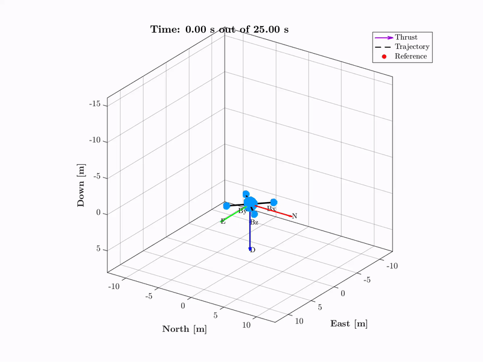

# Quadcopter from Scratch: Flight Software
**Part 2 of building a quadcopter from "scratch"**  
<a href="https://github.com/ex33/drone_sim" class="tag tag-big">GITHUB</a>
---

  

## Summary
This is <strong>Part 1</strong> of my quadcopter project. This part will go over my 6DOF simulation in MATLAB completed with:  

• Sensor modeling w/ noise 

• Motor modeling w/ time delay

• LQR Controller for setpoint regulation (waypoint)

• 18-State Error-State Kalman Filter w/ Bias States 

• Closed-loop propagation through non-linear dynamics for end-to-end GNC validation

For more background material, see [Part 0](quadcopterPart0.html). This section contains little to no context on some of the things that goes on, so it somewhat requires taking a quick look at the previous section. I will try to come back here and make this more stand-alone at some point.

