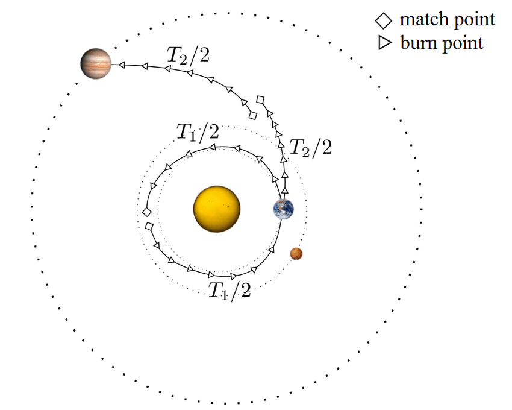
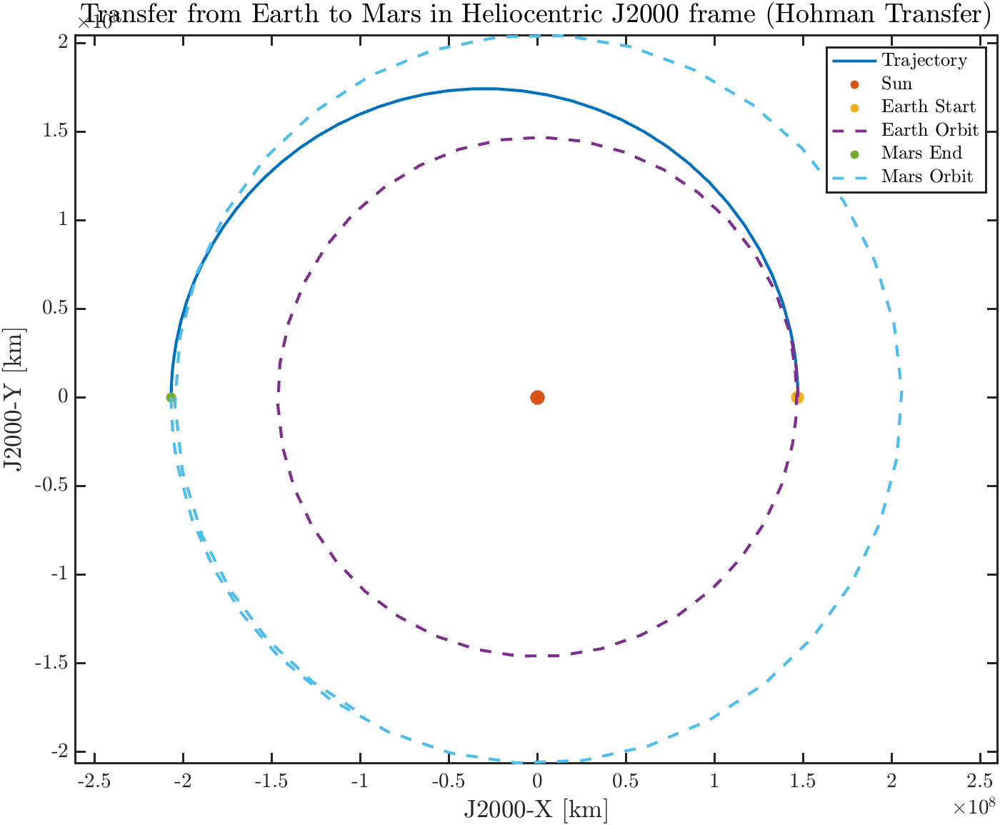
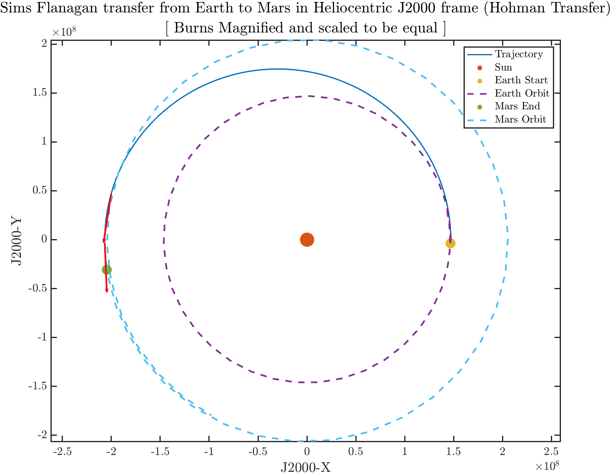
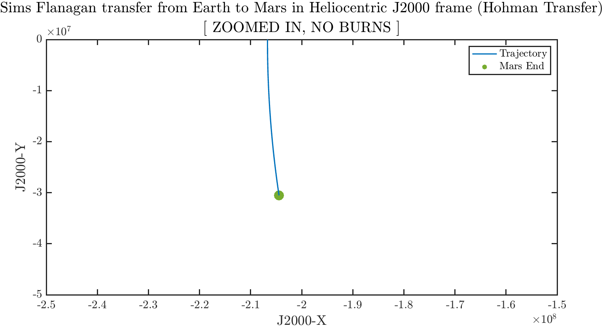
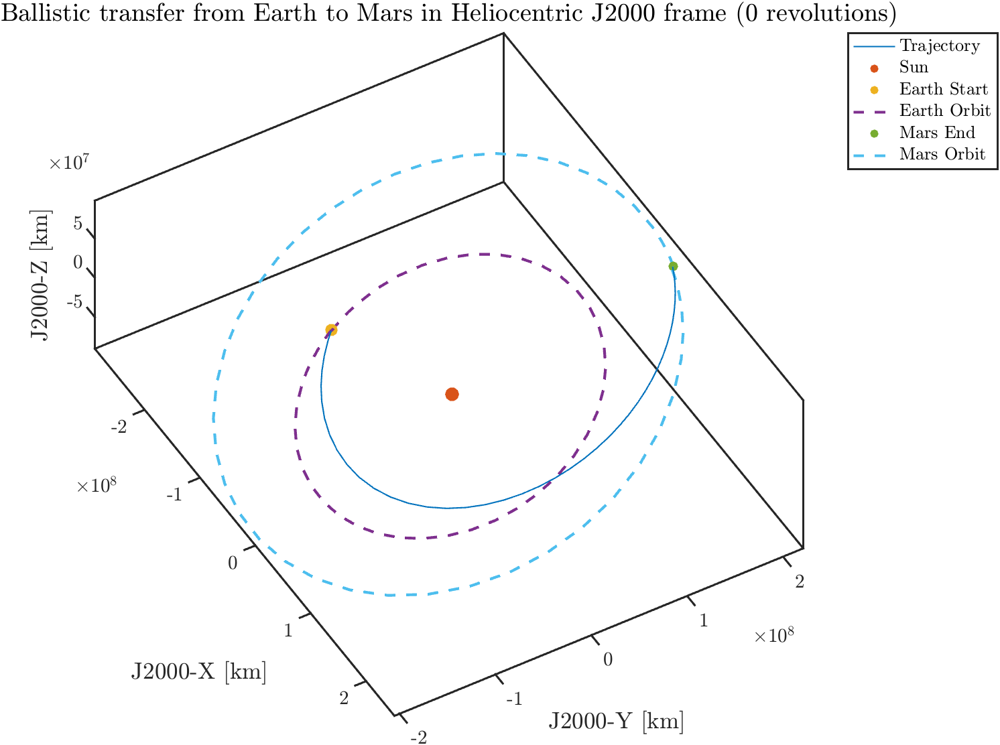
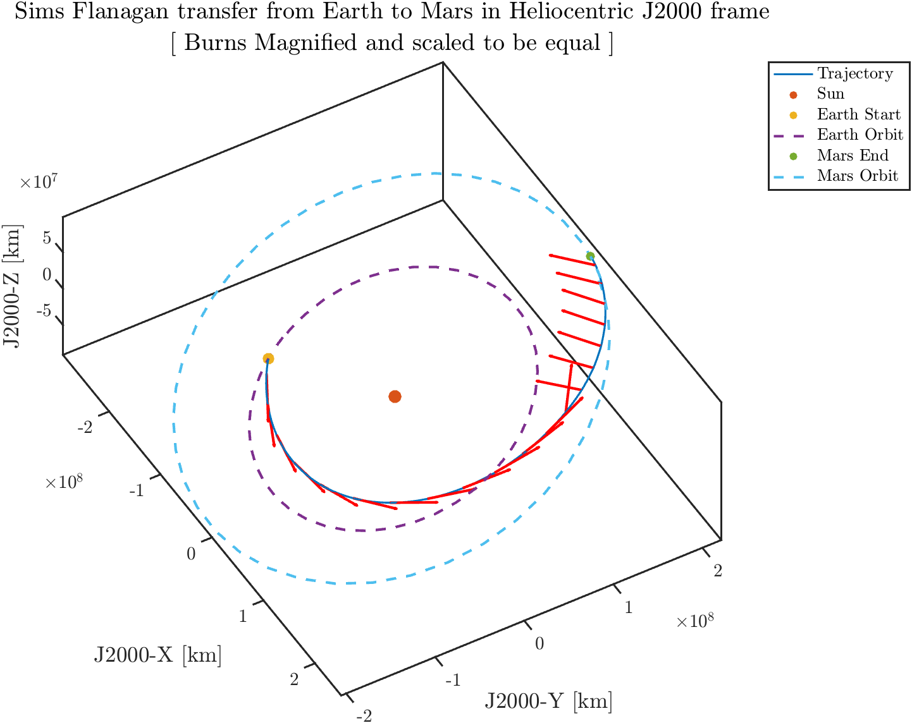
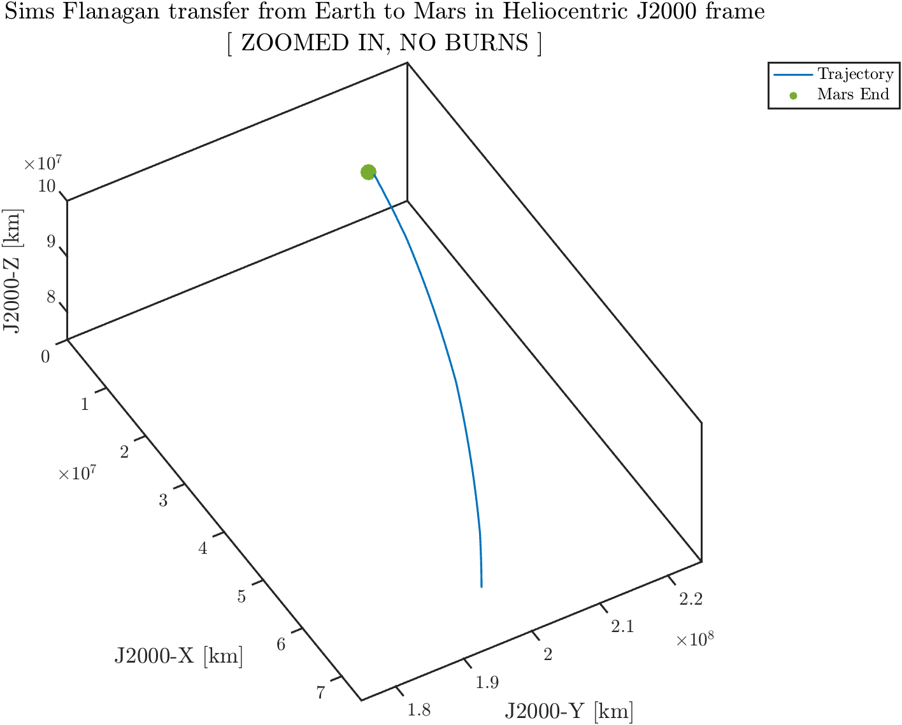
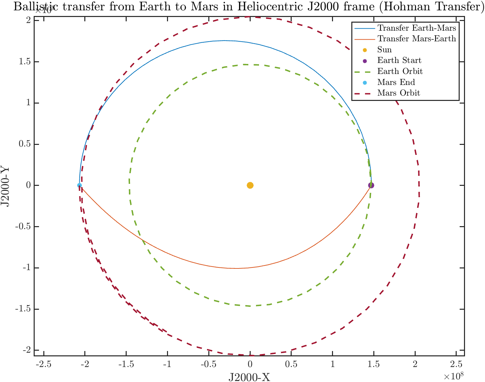
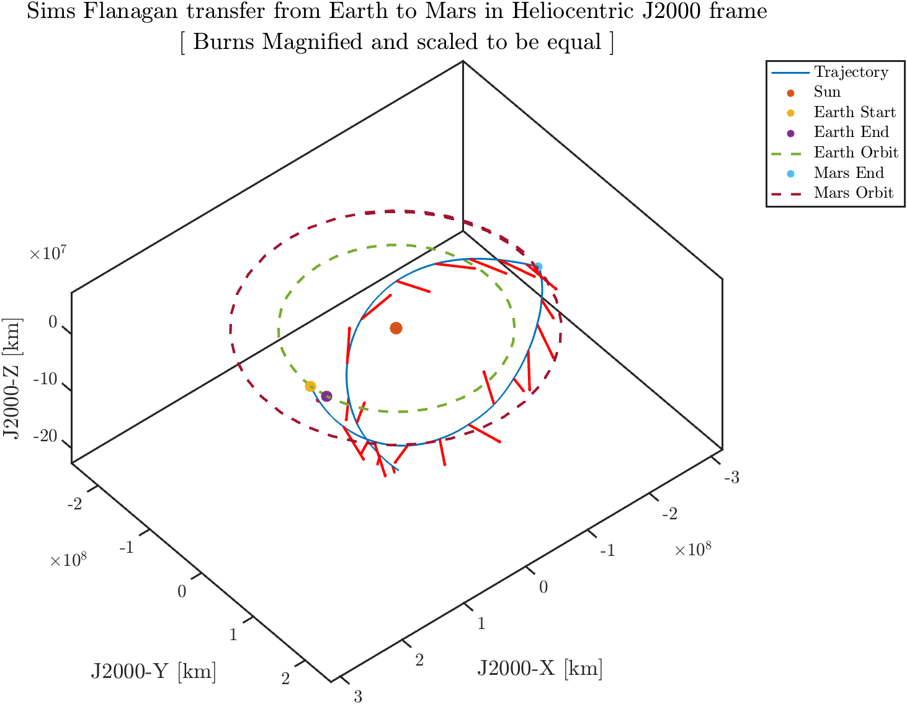

# Sims Flanagan Solver
<a href="https://github.com/ex33/sims_flanagan" class="tag tag-big">GITHUB</a>

<figure style="text-align: center;">
  
  <figcaption style="font-size: 0.8em">
    Diagram of discritized trajectory from Sims-Flanagan Method 
  </figcaption>
</figure>

<h2 id="comments">Comments</h2>
I started this in preparation for the 2025 Global Trajectory Optimization Challenge (GTOC), as problems typically contained low thrust propulsion, and past winners cited this method in their papers. Unfortunately, after getting through a couple Toy Problems to validate the solver, and waiting on the problem statement to be released to further refine things to be more problem specific, it was revealed that this year would be optimizing for flybys only (with some help from solar sails). This meant that Sims-Flanagan wasn't going to be the best choice, and so my focus quickly shifted. 

While I was bummed this wasn't used or incorporated into any of the tools at work, I did end up learning a lot about trajectory optimization that I hope to continue developing the practical skills for. My previous experience mostly included going through the tutorial for one of our optimizers at work, and I can confidently say this exercise was a far better learning opportunity in that I had to figure things out on my own and got to seeing how different choices impacts the final results (in terms of scaling, variable selection, NLP solvers, smoothness of objective/constraint functions relative to my cost function, etc).

I also chose fmincon as my solver mostly due to convenience. The majority of papers uses SNOPT, which I was able to get a pre-compiled version of, but unfortunately it was not compatable with my MAC-OS. I also looked into IPOPT, but since I the original plan was eventually use one of our in-house solvers, I decided to go with whichever would allow me to prototype fastests. 

## Table of Content
• <a href="#overview-of-sims-flanagan">Overview of Sims-Flanagan</a> 

• <a href="#methodology">Methodology</a> 
  &nbsp;&nbsp;&nbsp;&nbsp;↳ <a href="#decision-independent-variables">Decision / Independent Variables</a> 
  &nbsp;&nbsp;&nbsp;&nbsp;↳ <a href="#cost-function">Cost Function</a> 
  &nbsp;&nbsp;&nbsp;&nbsp;↳ <a href="#constraints">Constraints</a> 

• <a href="#code-structure">Code Structure</a> 
    &nbsp;&nbsp;&nbsp;&nbsp;↳ <a href="#sims-flanagan-m">sims_flanagan.m</a> 
    &nbsp;&nbsp;&nbsp;&nbsp;&nbsp;&nbsp;&nbsp;&nbsp;↳ <a href="#cost-function-m">costFunction.m</a> 
    &nbsp;&nbsp;&nbsp;&nbsp;&nbsp;&nbsp;&nbsp;&nbsp;↳ <a href="#nonlinear-constraints-m">nonlinearConstraints.m</a> 
    &nbsp;&nbsp;&nbsp;&nbsp;&nbsp;&nbsp;&nbsp;&nbsp;&nbsp;&nbsp;&nbsp;&nbsp;↳ <a href="#propagate-leg-m">propagate_leg.m</a> 

• <a href="#toy-problems">Toy Problems</a> 
    &nbsp;&nbsp;&nbsp;&nbsp;↳ <a href="#2d-earth-mars">2D Earth-Mars</a> 
    &nbsp;&nbsp;&nbsp;&nbsp;↳ <a href="#3d-earth-mars">3D Earth-Mars</a> 
    &nbsp;&nbsp;&nbsp;&nbsp;↳ <a href="#2d-earth-mars-earth">2D Earth-Mars-Earth</a> 

• <a href="#conclusion">Conclusion</a> 

<h2 id="overview-of-sims-flanagan">Overview of Sims-Flanagan</h2>
Sims-Flanagan refers to a direct optimization method introduce by Sims and Flanagan over at the Jet Propulsion Lab. The gist is that low thrust trajectories can be modeled as a series of impulsive maneuvers ($\Delta v$), and stitched together by conic sections. As the the number of $\Delta v$ increases, the solution becomes closer to representing the scenario under continuous thrust <a href="https://www.researchgate.net/publication/252938214_Preliminary_Design_of_Low-Thrust_Interplanetary_Missions?enrichId=rgreq-6f5cf92c1679ffe9e28cfb5bbc344d8c-XXX&enrichSource=Y292ZXJQYWdlOzI1MjkzODIxNDtBUzoyNzIxNDc5MTQ0MjQzMzdAMTQ0MTg5NjUyNzgzMg%3D%3D&el=1_x_3&_esc=publicationCoverPdf" target="_blank">[1]</a>. 

This being a direct method means that rather than introducing costates and finding the optimal solution via calculus of variation, the problem is optimized by selecting decision variables that can paramterize it, then passing it into a nonlinear programming software. The pros and cons of each are well documented in literature, but the main ones are that the indirect method are often extremely accurate and can result in closed-form control laws, but are can be sensitive to initial conditions. While direct methods are easier to implement at the cost of potentially requiring a lot more computational power (solution linked to discretization step size for example). 

Back to the method at hand, the trajectory is divided into legs, whose starting and ending points represents control nodes. Each node typically represents a planet or small body, which makes this applicable to gravity assist missions, but they can also be free space. Within each leg, there is one point that is considered the match point, where the trajectory at the start of the leg propagated to this point, must match up with the trajectory back-propagated from the end of the leg to this point. Typically, this point is somewhere in the middle of the trajectory, but some other implementations has multiple throughout the leg. 

From there, each leg is further divided into segments of equal propagation time, with an impulsive $\Delta v$ in the middle. Propagation occurs under a two-body model inbetween impulses and nodes, with the sun as the primary body. Flybys are also modelled as instaneous changes in the direction of the relative velocity vector. 

<h2 id="methodology">Methodology</h2>
In case the overview was skipped, the mainpoint is that a trajectory is problem up into legs, which is then further divided into segments. Typically, the starting and end points of a leg are planets. 

<h3 id="decision-independent-variables">Decision / Independent Variables</h3>
The decision/independent variables (parameters the solver changes to optimize cost function) are as follows:

• Departure Epoch $T_0$ $[1]$  

• Departure Velocity Relative to Earth $v_{\infty,0}$ $[3]$

• Magnitude of Impulses$\Delta v$ $[(N*L) \times 1]$ 

• Pitch of Each Impulses $\phi$ $[(N*L) \times 1]$ 

• Yaw of Each Impulses $\psi$ $[(N*L) \times 1]$ 

• Inbound Velocity Relative to Flyby Bodies $v_{\infty,in}$ $[(L-1) \times 1]$ 

• Outbound Velocity Relative to Flyby Bodies $v_{\infty,out}$ $[(L-1) \times 1]$ 

• Epoch of Flybys $T_{flyby}$ $[(L-1) \times 1]$ 

• Final Epoch $T_f$ $ [1]$ 

where and L represents the number of legs, and N represents the number of segments per leg.  

Note that the arrival velocity at the final planet / control node is NOT included here. This is because for a rendezvous mission, by definition, the final velocity of the spacecraft matches with the planets, resulting in a relative velocity of 0.

At this point, the first choice I made was to represent the maneuvers in the form of magnitude (impulses), and two euler angles (pitch and yaw). The pitch and yaw here are with respect to the velocity vector of the spacecraft. 

  
supporting_functions/getDV.m

  

    

      Input: Impulse ($\mathbf{\Delta v}$), Pitch ($\mathbf{\phi}$), Yaw ($\mathbf{\psi}$), Current Inertial Velocity ($\mathbf{v}$)
    

    

      1) Normalize the velocity vector: $\mathbf{\hat{v}} = \mathbf{v} / |\mathbf{v}|$
    

    

      2) Form rotations for yaw and pitch: $\mathbf{R3(\psi)}$ , $\mathbf{R1(\phi)}$
    

    

      3) Compute the resulting Maneuver: $u = \mathbf{R3(\psi)}\mathbf{R1(\phi)}\mathbf{\hat{v}}$
    

    

      return Outputted Maneuver $\mathbf{u}$
    

  

This could've been done with a simple cartesian vector in the heliocentric frame, but I decided to choose this representation (which is probably more convoluted for this than it has to be). 

 A couple weeks before I started this, I was sitting in on a hands-on series for one of our tools at work, and was told that often times, its easier to specify a burn direction off the current velocity vector (think of a hohman transfer at the perigee, your burn direction is easily defined off the velocity vector). 

In retrospect, I am wondering if using pitch/yaw angles may be causing some discontunities in the way the solver tries to optimize for the burn direction (I set upper and lower bounds so this shouldn't necessarily be the case).  

<h3 id="methodology">Cost Function</h3>
Given that this is meant to model continuous thrust, which typically has a high ISP, the cost function can be the standard minimum fuel usage, which is synonymous with maximizing the final mass: 
$$
J = -m_f
$$
The format above has a negative sign as fmincon will MINIMIZE the objective function, so the negative sign is needed if we wanted to maximize the mass instead. 

Alternative the other cost function that I tried (which sometimes lead to better results) such minimizing the time of flight:
$$
J = -(T_f - T_0)
$$

<h3 id="constraints">Constraints</h3>
The main constraints are as follows:
1. The position, velocity, and mass of the spacecraft must be continuous at the match points (as previously mentioned): 

$$
\begin{bmatrix} p \\ v \\ m \end{bmatrix}^-_{Matchpoint} 
=
\begin{bmatrix} p \\ v \\ m \end{bmatrix}^+_{Matchpoint} 
$$

2. Magnitude of the maneuvers ($\Delta v$) in a given segment are constrained by an upper limit ($\Delta v_{max}$)

Some other constraints I tried playing around with included enforcing an equality constraint on inbound and outbound flyby velocity magnitudes, as well as a turning angle constraint for the change in the relative velocity post flyby. The latter didn't work super well and it's unclear if its due to the scenario set-up I used, or if this method isn't set up to handle it given that its usually a preliminary mission design tool.
<h2 id="code-structure">Code Structure</h2>
The main structure is as follows:

sims_flanagan.m 
└──&nbsp;fmincon.m 
&nbsp;&nbsp;&nbsp;&nbsp;├──&nbsp;costFunction.m 
&nbsp;&nbsp;&nbsp;&nbsp;│&nbsp;&nbsp;&nbsp;&nbsp;&nbsp;└──&nbsp;unpackDecisionVector.m 
&nbsp;&nbsp;&nbsp;&nbsp;└──&nbsp;nonlinearConstraints.m 
&nbsp;&nbsp;&nbsp;&nbsp;&nbsp;&nbsp;&nbsp;&nbsp;├──&nbsp;unpackDecisionVector.m 
&nbsp;&nbsp;&nbsp;&nbsp;&nbsp;&nbsp;&nbsp;&nbsp;├──&nbsp;propagate_planet.m 
&nbsp;&nbsp;&nbsp;&nbsp;&nbsp;&nbsp;&nbsp;&nbsp;└──&nbsp;propagate_leg.m 
&nbsp;&nbsp;&nbsp;&nbsp;&nbsp;&nbsp;&nbsp;&nbsp;&nbsp;&nbsp;&nbsp;&nbsp;└──&nbsp;ode45.m 
&nbsp;&nbsp;&nbsp;&nbsp;&nbsp;&nbsp;&nbsp;&nbsp;&nbsp;&nbsp;&nbsp;&nbsp;&nbsp;&nbsp;&nbsp;&nbsp;└──&nbsp;two_body_ode.m

where fmincon.m and ode45.m are native MATLAB Functions so they will not be discussed.

Additionally the following are straightforward so will be briefly mentioned here: 

• <strong>unpackDecisionVector.m </strong>: Given the number of legs and number of segments, goes through the decision variable vector and unpacks it 

• <strong>two_body_ode.m</strong>: Just the two-body differential equation 

• <strong>propagate_planet.m</strong>: Given the initial state and time, and a desired final time, propagate the state forward under two-body dynamics using ode45. 

The following will just be a bunch of pseudocode with some commentary. 

<h3 id="sims-flanagan-m">sims_flanagan.m</h3>
The main purpose of this is to act as an entry function to access fmincon.m, while hiding some additional code like the lower and upper bounds, and options for fmincon. 

  
supporting_functions/sims_flanagan.m

  

    

      Input: Initial Decision Variables ($\mathbf{x_0}$), # Segments ($\mathbf{N}$), # Legs ($\mathbf{L}$), Gravitational Parameter ($\pmb{\mu}$), Gravity ($\mathbf{g_0}$), Initial Mass ($\mathbf{m_0}$), Specific Impulse ($\mathbf{isp}$), Max Thrust ($\mathbf{T_max}$), List of Planets ($\mathbf{Planets}$), Scaling Factors ($\mathbf{scales}$) 
    

    

       
      1) Unpack the $\mathbf{scales}$ for each variable
    
 

    

      2) Form lower and upper bounds on decision variables 
    
 

    

      3) Pass in costFunction.m, nonlinear_constraints.m, the initial decision variables ($\mathbf{x_0}$), and the lower / upper bounds into fmincon.m
    
 

    

      return Outputted fmincon Results 
    

  

The scales are used to ensure that the magnitude of each decision variable is about the same order of magnitude (typically all on the order of 1). This is so that the step sizes with respect to each variable are normalized due to each of them having different units and thus, different scales. For example, a small step in the time variables in seconds of 1 unit, is a large step for the pitch variables in radians. By scaling them, the goal is to ensure they all have similar notions of small and big step sizes. 

The scales I ended up using were the following:

• Position Scale: $1.496e8$  

• Time Scale: $31536000$

• Velocity Scale: $\sqrt{\mu_{sun} (\frac{1}{a_{earth}/2}+\frac{1}{a_{planet}/2})}$ 

• Impulse Scale: 7$ 

• Pitch Scales: $\pi$ 

• Yaw Scales: $2\pi$ 

• Mass Scales: $m_0$ 

The position scale is the conversion of AU to kilometers. Since this is focusing on a heliocentric frame, where the positions are roughly on this order of magnitude, I thought this was a good starting place. 

The time scale is simply the conversion of 1 year in terms of seconds. My time is the datetime converted into seconds from the J2000 reference point from using some spice functions. 

The velocity scale is a little iffy, but since I was assuming the starting and ending planets are approximately in circular orbits, I calculated the velocity of a circular orbit that is right in between the semi-major axis of both orbits as a middle ground. I calculated this using the vis-viva equation. 

The impulse scale was obtained by using the max thrust divided by the starting mass to get the max acceleration. This was then divided by the max $\Delta t$ for a segment, which can be found by using the initial TOF of a leg and dividing by the number of segments. Again, this probably isn't the best way considering the impulse depends on several factors. 

The Pitch / Yaw scales are due to the bounds on these angles. The pitch is from $-\pi$ to $\pi$, and the yaw is from $0$ to $2\pi$, so thats what I used.

The mass scale is just the initial mass, since after each subsequent impulse, the mass will be deceasing, which means this ratio will be order 1.

<h3 id="cost-function-m">costFunction.m</h3>
As the name suggests, this is where I put in my cost function for fmincon.m to evaluate against. 

  
supporting_functions/costFunction.m

  

    

      Input: Initial Decision Variables ($\mathbf{x_0}$), # Segments ($\mathbf{N}$), # Legs ($\mathbf{L}$), Gravitational Parameter ($\pmb{\mu}$), Gravity ($\mathbf{g_0}$), Initial Mass ($\mathbf{m_0}$),
      Specific Impulse ($\mathbf{isp}$), Max Thrust ($\mathbf{T_max}$), List of Planets ($\mathbf{Planets}$), Scaling Factors ($\mathbf{scales}$) 
    

    

       
      1) Unpack the $\mathbf{scales}$ for each variable
    
  

    

      2) Obtain the all impulses from decision variables and unscale results. 
    
 

    

      3) Unscale the initial mass
    
 

    

      4) For each impulse, propagate the mass iteratively using the rocket equation
    
 

    

      5) Re-scale the final mass and return as the cost
    
 
    

      return Cost function $\mathbf{J}$
    

  

Since the solver has access to the entire decision variable, the cost function needs to be able to be obtained from those variables, which is why the mass needed to be obtained from the impulses. But aside from that, this is pretty straight forward, you just need to provide the quantity that the solver is trying to minimize.

<h3 id="nonlinear-constraints-m">nonlinear_constraints.m</h3>
This is where all the equality and inequality constraints are defined for fmincon.

  
supporting_functions/nonlinear_constraints.m

  

    

      Input: Initial Decision Variables ($\mathbf{x_0}$), # Segments ($\mathbf{N}$), # Legs ($\mathbf{L}$), Gravitational Parameter ($\pmb{\mu}$), Gravity ($\mathbf{g_0}$), Initial Mass ($\mathbf{m_0}$), 
      Specific Impulse ($\mathbf{isp}$), Max Thrust ($\mathbf{T_max}$), List of Planets ($\mathbf{Planets}$), Scaling Factors ($\mathbf{scales}$) 
    

    

       
      1) Unpack the $\mathbf{scales}$ for each variable
    
 

    

      2) Undo scale to ALL decision variables in order to propagate normally
    
 

    

      3) Initialize empty arrays to contain the equality ($\mathbf{c_{eq}}$) and inequality ($\mathbf{c}$) constraints
    
 

    

      4) If there are ANY flybys, add the magnitude constraints on the inbound and outbound relative velocity to $\mathbf{c_eq}$
    
 

    

      5) For the current leg, get the initial planet, time and mass, along with the final planet, time, and flyby informations.
    
 

    

      6) Propagate the mass fully using the impulse from the decision vector. For each impulse and calculated mass,  
      add in the inequality constraint on the max impulse to $\mathbf{c}$.
    
 

    

      7) Using 5 and 6, the information for the starting state and final states of the spacecraft can be formed. 
    
 

    

      8) Call on propagate_leg.m to apply and add midpoint constraints to $\mathbf{c_{eq}}$
    
 

    

      return Equality and Inequality constraints ($\mathbf{c_{eq}}$ & $\mathbf{c}$)
    

  

<h3 id="propagate-leg-m">propagate_leg.m</h3>
This is where states at the matchpoing from forward and backward propagating the initial and final states of the current leg are calculated.

  
supporting_functions/propagate_leg.m

  

    

      Input: Initial State ($\mathbf{x_0}$), Final State ($\mathbf{x_f}$), Impulses of Leg ($\mathbf{\Delta v_{leg}}$), Pitches of Leg ($\pmb{\phi_{leg}}$), Yaws of Leg ($\pmb{\psi_{leg}}$), 
      Length of time per segment ($\mathbf{\Delta t}$), Gravitational Parameter of central body ($\pmb{\mu}$), Gravity ($\mathbf{g_0}$), Specific Impulse ($\mathbf{isp}$)
    

    

       
      1) Get the number of segments according to length of either $\mathbf{\Delta v_{leg}}$, $\pmb{\phi_{leg}}$, or $\pmb{\psi_{leg}}$
    
 

    

      2) Loop through and propagate the initial state according to $\mathbf{\Delta t/2}$, impulsive add the maneuver for the current segment,  
      then propagate the remaining $\mathbf{\Delta t/2}$. Repeat until midpoint achieved.
    
 

    

      3) Do the same with the final state, but now propagating by $\mathbf{-\Delta t/2}$, and need to "subtract" the maneuver.
    
 

    

      4) Extract out the final state at the midpoints from both loops
    
 

    

      6) Propagate the mass fully using the impulse from the decision vector. For each impulse and calculated mass,  
      add in the inequality constraint on the max impulse to $\mathbf{c}$.
    
 

    

      return States at midpoint from forward and backward propagation ($\mathbf{x_{midpoint}^-}$ & $\mathbf{x_{midpoint}^+}$)
    

  

<h2 id="toy-problems">Toy Problems</h2>
In the following toy problems, it will simulate an Earth-Mars trajectory (1 leg) along with an Earth-Mars-Earth trajectory (2 leg). This will be a direct transfer without any revolution in order to reduce the complexity of figuring out an initial guess.

Some more optimizer settings includes the following lower and upper bounds:

• Initial / Final Time and Flyby Windows Upper / Lower Bounds: $+/- 2$ Weeks from $T_0$ and $T_F$   

• Impulse Magnitude Lower Bound: $0$

• Pitch Upper / Lower Bound: $+/- \frac{\pi}{2}$ 

• Yaw Upper / Lower Bound: $2\pi$ & $0$ 

Along with the following options for fmincon:

• Algorithm: SQP  

• MaxIterations: 1000

• MaxFunctionEvaluations: 1e6

• StepTolerance: 1e-7

• ConstraintTolerance: 1e-8

• OptimalityTolerance: 1e-5

• MaxFunctionEvaluations: 50000

<h3 id="2d-earth-mars">2D Earth-Mars</h3>
In this scenario, the leg is split into 10 segments. Earth will start at an arbitrary time $T_0$, while Mars will be at a time $T_f$ that results in the TOF it would be approximately equal to a Hohman transfer or a Lambert Solver's solution. 

Both Mars and Earth will be assumed to be in a circular orbit around the sun.

The constants of this scenario are as follows:

• Gravitational Parameter of the Sun ($\mu_{sun}$): $1.327e11 \frac{km^3}{s^2}$   

• Gravitational Acceleration ($g_0$): $0.0098065 \frac{km}{s^2}$

• Initial Total Mass ($m_0$): $6000 kg$ 

• Max Thrust: $5N$ 

• ISP: $4000s$ 

• Number Legs ($L$): $1$ 

• Number Segments ($N$): $10$ 

• Semi-major axis of Earth Orbit ($a_{Earth}$): $1.47e8km$ 

• Semi-major axis of Mars Orbit ($a_{Mars}$): $2.067e8km$ 

The first step is to determine the initial states, as well as the relevant components of the initial guess we can get from a Hohman transfer solution. 
To make things even simplier, the following will be the initial and final positions of the Earth and Mars:
$$
p_{Earth} = \begin{bmatrix}a_{Earth}\\ 0\\ 0 \end{bmatrix} , p_{Mars} = \begin{bmatrix}-a_{Mars}\\ 0\\ 0 \end{bmatrix} 
$$
And since both are in circular orbits, the starting velocity can be deduced to be perpendicular and its magnitude can be found by the vis-viva equation (so finding the velocity that enforces a circular orbit):
$$
v^2 = \frac{2\mu}{r} - \frac{\mu}{a} = \frac{2\mu}{a} - \frac{\mu}{a} = \frac{\mu}{a} 
$$
Thus, the following are the initial and final velocities of the planets: 
$$
v_{Earth} = \begin{bmatrix}0 \\ \sqrt{\frac{\mu}{a_{Earth}}}\\ 0 \end{bmatrix} , v_{Mars} = \begin{bmatrix} 0 \\ -\sqrt{\frac{\mu}{a_{Earth}}}\\ 0 \end{bmatrix} 
$$

Going through the steps and calculating the impulses required for the first insertion burn onto the transfer orbit, then the second circularizing burn to rendezvous with Mars:
$$
\begin{align}
\Delta v_1 &= \sqrt{\frac{2\mu_{sun}}{a_{Earth}} - \frac{\mu_{sun}}{a_t}} - \frac{\mu_{sun}}{a_{Earth}} \\
\Delta v_2 &= \frac{\mu_{sun}}{a_{Mars}} - \sqrt{\frac{2\mu_{sun}}{a_{Mars}} - \frac{\mu_{sun}}{a_t}}   \\
\end{align}
$$
where $a_t = (a_{Earth}+a_{Mars})/2$ and represents the semi-major axis of the transfer orbit.

The first impulse will be used as an initial guess for the departure Velocity Relative to Earth ($v_{\infty,0}$), while the second impulse will be used as an initial guess for the very last impulse/pitch/yaw (all other entries will be set to 0 for a ballistic transfer).

For a Hohman transfer, the TOF will only be half the period of the resulting transfer orbit:
$$
TOF = \frac{\pi}{\sqrt{\mu_{sun}/a_t^3}}
$$

which can be shown visually below:
<figure style="text-align: center;">
  
  <figcaption style="font-size: 0.8em">
    Propagated Hohman Transfer from Earth to Mars
  </figcaption>
</figure>

Since there is no flybys, the only remaining initial condition is the final time, which can be found by just adding the initial time to the time of flight. 

Providing all the necessary parameters into sims_flanagan.m, the results are as follows:
<figure style="text-align: center;">
  
  <figcaption style="font-size: 0.8em">
    2D Earth-Mars propagated Solution From Sims-Flanagan Solver
  </figcaption>
</figure>
It can be seen that the Hohman transfer solution here was pretty spot on, which makes sense. There only needed to be another corrective burn right before the final one, which probably comes from the final burn not being able to be executed precisely at the apogee. 

Here is the zoomed in trajectory:
<figure style="text-align: center;">
  
  <figcaption style="font-size: 0.8em">
    2D Earth-Mars propagated Solution From Sims-Flanagan Solver [Zoomed]
  </figcaption>
</figure>
where its more clear that the trajectory does rendezvous with Mars.

<h3 id="3d-earth-mars">3D Earth-Mars</h3>
So same scenario as before, but now extended to the third dimension. At this point, I used the Spice libraries in order to obtain the Earth's initial state at an epoch $T0$, then using the time of flight from the 2D problem, obtained the Mar's state at $T_f=T_0+TOF$. From here, I decided to switch over to using a Lambert Solver to get my initial conditions, as the orbits aren't necessarily co-planar.  

Lambert Solution returns returns two inertial velocities. The first velocity is subtracted by the Earth's to obtain the initial guess for the $v_{\infty,0}$, while the second will be subtracted by Mar's velocity in order to assign to the last index of the impulse vector.

The trajectory resulting from the Lambert transfer is as follows:
<figure style="text-align: center;">
  
  <figcaption style="font-size: 0.8em">
    Propagated Hohman Transfer from Earth to Mars
  </figcaption>
</figure>

which shows the initial guess would put us on a trajectory to rendezvous with Mars. 

The one other change here is that the number of segments has been increased to 20, which increases run time but should provide some more fidelity. 

Providing all the necessary parameters into sims_flanagan.m, the results are as follows:
<figure style="text-align: center;">
  
  <figcaption style="font-size: 0.8em">
    3D Earth-Mars propagated Solution From Sims-Flanagan Solver
  </figcaption>
</figure>
Here is the zoomed in trajectory:
<figure style="text-align: center;">
  
  <figcaption style="font-size: 0.8em">
    3D Earth-Mars propagated Solution From Sims-Flanagan Solver [Zoomed]
  </figcaption>
</figure>

This shows that the solver is able to handle 2D and 3D cases for a simple rendezvous trajectory from one planet to the next.

<h3 id="2d-earth-mars-earth">2D Earth-Mars-Earth</h3>
The particular set up here involves an Earth to Mars transfer, then a Mars to Earth transfer that results in about the same place, such that the entire transfer is equal to the period of the Earth. 

Knowing that the entire transfer will be equal to the period of the Earth, the first transfer will arbitraily be selected to take up 2/3 of this, and the second transfer will take up 1/3, representing a ballaistic trajectory to Mars, then a faster transfer back with the help of a gravity assist.  

I also tried using the TOF as the cost function in an attempt to get the optimizer to try to ignore the longer trajectories, but while this resulted in the solver exiting, the resulting solution isn't great. Playing around with the scales of things does help a little here, but doesn't feel like the solution I am looking for.

Using the information of the states from the previous section, the following trajectory resulting from the Lambert transfer is as follows:

<figure style="text-align: center;">
  
  <figcaption style="font-size: 0.8em">
    Propagated Lambert Solver Solution from Earth to Mars to Earth
  </figcaption>
</figure>

which verifies that the lambert solution will take us to Mars at the state specified, then bring us back to the initial Earth State all within the specified TOF of 1 Earth Period.

The rest of the setup is the same as the previous two problems, with the exception that for the second transfer, the initial velocity will be subtracted by Mar's velocity to determine the outbound velocity relative to the flyby body $v_{\infty,out}$, and the second velocity will be subtracted by the initial velocity of the Earth and assigned as the final impulse to the decision vector.

Running the function returns the following:
<figure style="text-align: center;">
  
  <figcaption style="font-size: 0.8em">
    Propagated Solution From Sims-Flanagan Solver
  </figcaption>
</figure>

So clearly the solver has failed, which is visually shown by the plot. Rather than staying planar, it looks like the solution tried to search for a out of plane answer. My running theory right now is that the flyby is not constrained enough, that the optimizer is able to run through a wide range of physically impossible turning angles, causing it to go down various paths that isn't the optimal solution. It also seems like giving the solution it spits out back into the solver to re-optimize does not improve things. 

The strange thing is that the solver actually exits without an error or hitting any of the max function evaulations. The message mentions that the constraints are all satisfied, which makes me think this could also be a scaling issue.
Unfortunately, this was where my progress has ended.

<h3 id="conclusion">Conclusion</h3>
I would love to continue looking into this at some point, maybe once I get more experience and try to get the flyby scenarios to work. It could've been a simple flyby logic that I ended up mis-coding, or adding turning angle constraints is necessary. At the start, I was learning how to set this problem up so there were a lot of issues just from the coding side to get it to where it is. I also didn't have experience running NLP solvers much before this, so a lot of naunce are probably missed.

If I were to revisit this, I would do a lot more reading into all the different criterias and outputs of fmincon. I only had surface level knowledge of what each one did, so there may be one knob that I did not turn right that could resolve m issues.  I also wished I had a better way to find initial conditions. The methods I used here were for impulsive maneuvers, which clearly is not what is being modeled. Luckily, it looks like this worked well for the 1 leg cases. I also would have loved to try this out for a more applicable scenario rather than my made up one with more realisitic parameters. 

Afterwards, I'd like to look into applying a continuous thrust model (modeling impulses as finite over the segment) for higher fidelity and Suddman transformations to my time propagation to maintain the current run time or even improve it. Both of these are discussed in this paper by ESA and is currently in their open source tool, so the performance could be compared <a href="https://www.esa.int/gsp/ACT/doc/MAD/pub/ACT-RPR-MAD-2010-(AstroTools)Sundmann.pdf" target="_blank">[2]</a>. 

<section id="references" class="references">
  <h2>References</h2>
  <ol>

<li id="cite-sims-flanagan">
  Sims J., Flanagan S., 
  <i>California Institute of Technology</i>, NASA Jet Propulsion Lab
  
    <a href="#cite-sims-flanagan-ref" title="Back to main text">↑</a>
   
  <a href="https://www.researchgate.net/publication/252938214_Preliminary_Design_of_Low-Thrust_Interplanetary_Missions?enrichId=rgreq-6f5cf92c1679ffe9e28cfb5bbc344d8c-XXX&enrichSource=Y292ZXJQYWdlOzI1MjkzODIxNDtBUzoyNzIxNDc5MTQ0MjQzMzdAMTQ0MTg5NjUyNzgzMg%3D%3D&el=1_x_3&_esc=publicationCoverPdf" target="_blank">
    [Link]
  </a>
</li>

<li id="cite-sims-flanagan">
  Yam, C. H., Izzo, D., & Biscani, F. (2010). Towards a high fidelity direct transcription method for optimisation of low-thrust trajectories
  <i>European Space Agency</i>
  
    <a href="#cite-esa-ref" title="Back to main text">↑</a>
   
  <a href="https://www.esa.int/gsp/ACT/doc/MAD/pub/ACT-RPR-MAD-2010-(AstroTools)Sundmann.pdf" target="_blank">
    [Link]
  </a>
</li>

  </ol>
</section>

